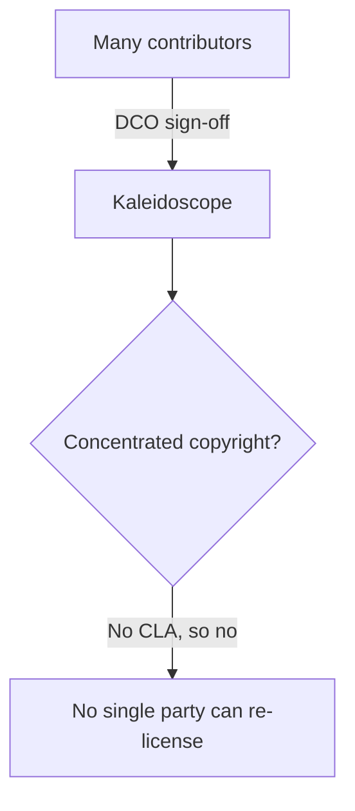

Kaleidoscope is licensed in two classes by component role. The split is the
structural protection against the rug-pull pattern described in
[Why it exists](/start/why/), and it has direct consequences for how you can use
the code.

## Platform components — AGPL-3.0-or-later

The server-side components — Aperture, the storage engines, query, alerting and
the rest — are released under
[AGPL-3.0-or-later](https://www.gnu.org/licenses/agpl-3.0.html). Anyone may use,
modify and redistribute them. Anyone offering them as a network service to others
must publish their modifications under the same licence.

AGPL closes the SaaS loophole that drove Elastic, MongoDB, Redis and HashiCorp to
abandon open source — and it does so inside the OSI-approved perimeter, so it is
still genuinely open source, not a source-available licence pretending to be one.

## SDKs and protocol libraries — Apache-2.0

The client-side and protocol code — the OTLP conformance harness, the Spark SDK,
generated code, the on-disk format spec — is released under
[Apache-2.0](https://www.apache.org/licenses/LICENSE-2.0). This means you can
embed it in proprietary application code without copyleft contamination, and it
carries an explicit patent grant.

The practical upshot: instrumenting your own application with Spark, or building
on the protocol libraries, never obliges you to open-source your application.
Only running the *platform* as a service for others triggers the AGPL's sharing
requirement.

## Contributions — Developer Certificate of Origin, no CLA

There is no Contributor Licence Agreement, and there will be no Contributor
Licence Agreement. Contributions are accepted under the
[Developer Certificate of Origin](https://developercertificate.org/): each commit
is signed off (`Signed-off-by: Name <email>`), asserting the contributor has the
right to submit the work under the project's licence.

This is the load-bearing part of the protection. With many contributors and no
concentrated copyright assignment, no future maintainer or entity can
unilaterally re-license Kaleidoscope, because nobody will own enough of the
copyright to legally do it. The licence text alone is necessary but not
sufficient; the absence of a CLA is what makes the protection structural.

## Trademark

The name **Kaleidoscope** and the logo are reserved trademarks of the project.
The code is free; the name and logo are not. This prevents bad-faith forks from
claiming to be the original.

## Why this exact arrangement

The two-class split is the same arrangement Grafana Labs used before moving to
AGPL across the board, and that MongoDB used before SSPL. It is the most
battle-tested arrangement for keeping infrastructure software free against vendor
pressure. The full per-crate licence table and the complete rationale live in
`LICENSING.md` in the repository.

## Contribution status today

Kaleidoscope is currently a single-author project and external pull requests are
not yet accepted. The repository is public so the design can be read and
observed. Star or watch the repository to be notified when contribution opens.
