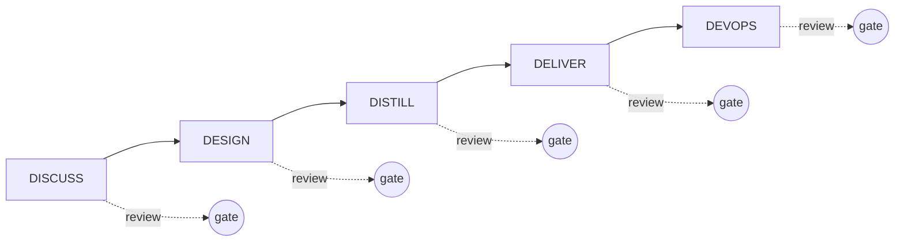

Kaleidoscope is, among other things, a case study. Every line of its code is
written by AI agents, and the reason it does not feel reckless is the methodology
holding the agents in check. That methodology is **nWave**, an AI-amplified
delivery framework by Alessandro Di Gioia and Michele Brissoni at
[nWave.ai](https://nwave.ai). Andrea adopts it and dogfoods it on his projects;
Kaleidoscope is the dogfooding worked example.

This page is background, not a prerequisite for using Kaleidoscope. But if you
care *how* a platform built entirely by AI agents can be trusted, this is the
answer.

## Five waves per feature

Every feature passes through five waves, each led by a specialised AI agent, and
each critiqued by a separate specialised reviewer agent. Nothing ships until both
the lead and the reviewer pass.

**DISCUSS** — the product owner. User stories, journeys, acceptance criteria,
Elephant Carpaccio slices that each ship end-to-end value.

**DESIGN** — the solution architect. C4 diagrams, Architecture Decision Records,
technology choices.

**DISTILL** — the acceptance designer. Executable acceptance tests, all RED on
day one because no implementation exists yet.

**DELIVER** — the software crafter. Outside-in TDD turns RED into GREEN, one
slice at a time, red → green → refactor.

**DEVOPS** — the platform architect. CI/CD gates, observability, deployment
readiness.

## Why peer review at every gate

The core insight is simple: **AI-generated work is not trusted work.** Speed of
generation does not reduce the need for verification — if anything it raises it.
So a second specialist agent reads the first one's output with a different brief.
Either both pass, or the wave does not close.

This is what lets a solo author dogfood the discipline of a high-functioning
engineering team, without the team, without the bus factor, and without the
ceremony that exists only to coordinate humans.

## The gates that hold

The CI pipeline enforces blocking gates per feature: dependency policy
(`cargo deny`), the full test suite, public-API stability (`cargo public-api`),
semver checking (`cargo semver-checks`), and — the one that matters most —
**mutation testing** (`cargo mutants`) at a **100% kill rate** on the diff.
Mutation testing is what proves the tests are real: it mutates the code and
checks that some test fails. A green test suite that survives mutation is a test
suite that was not actually testing anything.

## The load-bearing idea

The lesson the whole project is built to demonstrate:

> AI agents do not replace engineering discipline. They amplify it. The
> methodology is the load-bearing structure; the agents are the cheap labour
> that lets you afford the methodology. Without the discipline, the speed becomes
> recklessness very quickly.

There is direct evidence for this in the project's own history. An overnight
session once produced thirty-one direct commits with no nWave artefacts — each
individually defensible, cumulatively an abandonment of the methodology. It was
reverted the next morning and redone properly through the five waves. The typing
took fifteen minutes; the methodology took hours. The typing is the cheapest part
of software; the audit trail is what makes a change a piece of the platform
rather than a piece of code.

For the feature-by-feature account, see the [build journal](/background/journal/).
