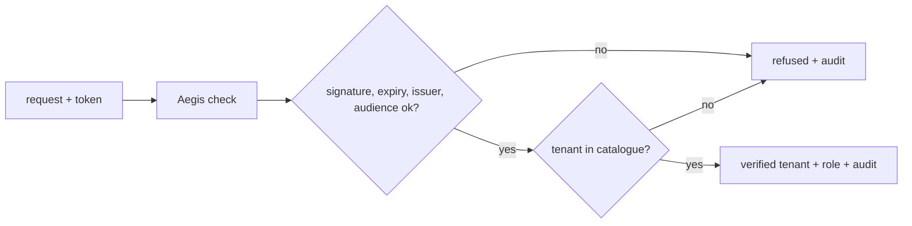

v0 &nbsp;·&nbsp; Integration plane &nbsp;·&nbsp; AGPL-3.0 &nbsp;·&nbsp; Replaces <strong>Datadog RBAC, New Relic user management</strong>

Aegis is identity: authentication, authorization, multi-tenancy and audit. It
turns a bearer token into a verified tenant or a clear refusal, and records one
audit entry for every decision. Unlike the vendors' offerings, it is in the free
product, always.

## What it does

Aegis takes a bearer token (a JWT), checks its signature, expiry, issuer and
audience, looks the tenant it names up in an operator-managed catalogue, and
returns the verified tenant and role or a clear reason for refusal. Every check
emits one audit event — allowed or denied — with stable fields, so the audit trail
is complete by construction.

## How it works

The signing key is a shared secret, loaded once, so a check does no network call
and is fast. The tenant catalogue is a TOML file, rejected loudly if it has
unknown fields or duplicate tenants. There are two roles, viewer and operator, and
the audit events are emitted in a standard form that your log pipeline can route
into [Lumen](/components/lumen/).

### Gating the gateway

Aegis now guards [Aperture's](/components/aperture/) ingest path, fail-closed. The
gateway is configured with an issuer, audience, a path to the signing secret and a
path to the tenant catalogue; it checks the bearer token on every request before
the telemetry is accepted, and refuses to start without a complete configuration.
The verified tenant travels with the telemetry through the pipeline. See [Run the
gateway end to end](/getting-started/gateway/).

## What works today

Token checking that does no network call and so is fast, a TOML tenant catalogue,
two roles, and one audit event per decision. On the ingest path, both gRPC and
HTTP reject the full range of invalid tokens, the gateway refuses to start without
a complete auth configuration, and the signing secret is read from a file and
never logged.

## Roadmap and limits

- **Shared-secret signing only.** Public-key signing and key rotation are a later
  version.
- **Authentication, not yet authorization, on ingest.** At v0 any valid token for
  a known tenant may ingest; restricting by role is deferred.
- **Read-path authentication covers all three read APIs.** The metrics, log and
  trace read APIs can now require a bearer token and scope the query to that
  token's tenant. Authorization by role is still to come (see below).
- **The heavier machinery** — workload identity, policy engines, external identity
  providers, secret managers and a database-backed catalogue — is all later.

## Key points

The read APIs can now sit behind Aegis, but on every authenticated path a token's
validity is checked while what a valid token may do is not yet restricted by
role. Plan for that role-level gap when weighing it for production.
