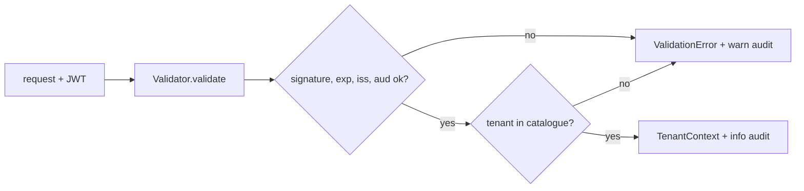

v0 &nbsp;·&nbsp; Integration plane &nbsp;·&nbsp; AGPL-3.0 &nbsp;·&nbsp; Replaces <strong>Datadog RBAC, New Relic user management</strong>

Aegis is identity: authentication, authorization, multi-tenancy and audit. It
turns a bearer token into a verified tenant context or a typed refusal, and
records exactly one audit event for every decision. Unlike the vendors' offerings,
it is in the free product, always.

## What it does

Aegis takes a JWT, validates its signature, expiry, issuer and audience, looks the
carried tenant up in an operator-authored catalogue, and returns a
`TenantContext { tenant_id, role }` or one of eight typed `ValidationError`s.
Every call emits one structured `tracing` event — an `info` on allow, a `warn` on
deny — with stable field names, so the audit trail is complete by construction.

## How it works

- **HS256 JWT validation.** The signing key is pre-shared bytes; the decoding key
  is computed once at construction, so `validate` does no I/O and no network call.
  The algorithm is pinned to HS256 to avoid algorithm-confusion attacks.
- **TOML tenant catalogue.** Loaded with `deny_unknown_fields` and duplicate-id
  rejection, with O(1) membership checks.
- **Two roles.** `Viewer` and `Operator`.
- **Audit by tracing.** Your subscriber routes the events to [Lumen](/components/lumen/)
  once you run it.

### Gating Aperture ingest

The `aegis-ingest-auth-v0` feature (ADR-0068) wires this validator onto
[Aperture's](/components/aperture/) live ingest path, fail-closed. Aperture reads
a `[aperture.security.auth.jwt]` block (issuer, audience, `secret_file`,
`catalogue_path`), validates the bearer token on every gRPC and HTTP request
before the body reaches a sink, and refuses to start without a complete config.
The validated tenant is carried with each record through the pipeline as a
type-level guarantee. See [Run the gateway end to end](/getting-started/gateway/).

## What works today

The public surface includes `Validator`, `ValidatorConfig`, `TenantContext`,
`TenantId`, `Role`, `ValidationError`, and the catalogue loader. KPIs: validation
p95 around 1 ms, catalogue load of 1,000 tenants within 50 ms, 100% audit
completeness. The ingest-auth wiring shipped with a full gRPC and HTTP reject
matrix, refuse-to-start, and a test asserting the secret never appears in
anything the process prints.

## Roadmap and limits

- **HS256 only.** Asymmetric keys (RS256) and JWKS rotation are a later version.
- **Authentication, not yet authorization, on ingest.** At v0 any valid token for
  a catalogued tenant may ingest; role-gating is deferred.
- **Read-path auth** (the query APIs) is deferred to a future feature.
- **The heavier machinery** — SPIFFE/SPIRE, OPA policy, Dex/Keycloak federation,
  OpenBao secrets, a database-backed catalogue — is all v1 or later.

:::note
The crate's own doc comment currently overstates this as "issuer + JWKS"; the
validator is HS256 pre-shared-key only, with JWKS reserved for v1. The project
tracks that wording as a doc fix.
:::

## Key decisions

ADR-0068 (ingest authentication). Aegis's own v0 DESIGN collapsed into its
implementation commit; the ingest-auth ADR builds on ADR-0061 (refuse-to-start),
ADR-0008 (config schema) and ADR-0007 (sink port).
