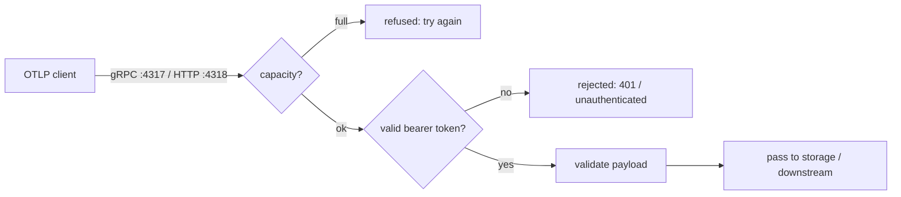

v0 &nbsp;·&nbsp; Integration plane &nbsp;·&nbsp; AGPL-3.0 &nbsp;·&nbsp; Replaces <strong>Datadog Agent, Splunk UF, OpenTelemetry Collector</strong>

Aperture is the front door. It is the first network-facing component: a
long-lived service that receives OTLP, validates every payload, authenticates the
request, and passes accepted telemetry on for storage. It holds no data of its
own.

## What it does

Aperture listens for OTLP over gRPC (`:4317`) and HTTP/protobuf (`:4318`) for all
three signals. Each request is admitted only if there is capacity, the bearer
token is valid, and the payload is well-formed; then its telemetry is passed
downstream. Aperture also exposes health and readiness endpoints, pushes back
under load rather than queueing, drains in flight work on shutdown, and can
forward OTLP to a downstream backend.

## How it works

The decisions that matter to an operator:

- **Validation first.** Every payload is checked for OTLP conformance before
  anything else happens to it.
- **Backpressure, not queueing.** When Aperture is at capacity it refuses new
  requests with a clear "try again" signal (a `503` with `Retry-After` over HTTP)
  rather than buffering them or dropping them silently. Durable buffering is
  [Sluice's](/components/sluice/) job. The default ceiling is 1024 requests in
  flight per protocol, which you account for when sizing memory.
- **Refuse, don't pretend.** If you enable a security feature Aperture cannot yet
  honour (TLS or SPIFFE), it refuses to start rather than binding in plaintext
  while implying encryption.
- **Honest failure.** If the serving loop dies after start-up, readiness flips to
  unhealthy and the process exits with a distinct code, rather than appearing to
  run.

### Authenticated ingest

Aperture authenticates every request against an [Aegis](/components/aegis/) JWT
before the telemetry is accepted, fail-closed. A gateway without a complete auth
configuration refuses to start, and the authenticated tenant travels with the
telemetry through the rest of the pipeline. See [Run the gateway end to
end](/getting-started/gateway/) for the configuration.

## What works today

Configuration is TOML, and an unknown key is rejected loudly rather than ignored.
You can set the bind addresses, message-size limits, per-protocol concurrency, the
sink, a forwarding endpoint, and the shutdown drain deadline. Logs are emitted as
structured JSON to stderr. Aperture runs inside the `kaleidoscope-gateway` binary,
which persists received telemetry into the durable stores.

## Roadmap and limits

- **TLS and SPIFFE** are not implemented; the settings exist for forward
  compatibility, default off, and Aperture refuses to start if you turn them on.
  Real transport security is Phase 2.
- **No internal queue** — Aperture pushes back rather than buffering; durable
  buffering is Sluice's remit.
- **No metrics output about itself** at v0.
