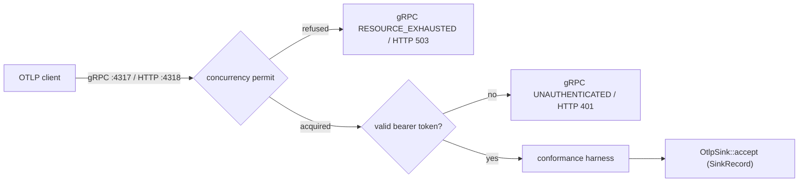

v0 &nbsp;·&nbsp; Integration plane &nbsp;·&nbsp; AGPL-3.0 &nbsp;·&nbsp; Replaces <strong>Datadog Agent, Splunk UF, OpenTelemetry Collector</strong>

Aperture is the front door. It is the first network-facing component: a
long-lived service that listens for OTLP, validates every payload against the
conformance harness, authenticates the request, and hands accepted records to a
pluggable sink. It holds no durable state of its own.

## What it does

Aperture listens on gRPC (`:4317`) and HTTP/protobuf (`:4318`) for all three
OTLP-stable signals. Each request passes a concurrency permit, then bearer-token
authentication, then conformance validation, before its records reach the
configured sink. It also exposes `/healthz` and `/readyz`, applies per-transport
backpressure, drains gracefully on shutdown, and can forward OTLP to a downstream
endpoint.

## How it works

The load-bearing decisions:

- **Transport stack.** `tonic` for gRPC and `axum`/`hyper` for HTTP on
 one Tokio runtime; the harness validation runs synchronously on the receiving
 thread because it is fast and CPU-bound.
- **The sink port.** `OtlpSink::accept(SinkRecord)` is the single
 boundary; `SinkRecord` is a three-variant enum (Logs / Traces / Metrics)
 carrying the OTLP type unwrapped. This is the seam [Sieve](/components/sieve/)
 decorates and the gateway uses to persist into the storage pillars.
- **Backpressure.** A per-transport semaphore refuses deterministically
 when full — gRPC `RESOURCE_EXHAUSTED`, HTTP `503` with `Retry-After` — rather
 than queueing or silently dropping. There is no internal queue; that is
 [Sluice's](/components/sluice/) job. The default cap is 1024 in-flight per
 transport, which operators must account for when sizing memory.
- **Refuse, don't pretend.** Enabling the `tls.enabled` or
 `auth.spiffe.enabled` knobs makes Aperture *refuse to start* (exit 2, nothing
 bound) rather than bind plaintext while implying encryption.
- **Honest failure surfacing.** A serving-loop death after bind flips
 readiness to a sticky failed state and exits with a distinct code, rather than
 being swallowed.

### Authenticated ingest

As of `aegis-ingest-auth-v0`, Aperture builds an
[Aegis](/components/aegis/) HS256 JWT validator once and checks the bearer token
on every request before the body reaches a sink — fail-closed. A gateway with a
missing or incomplete `[aperture.security.auth.jwt]` block refuses to start. The
validated tenant rides with each record through the pipeline. See [Run the
gateway end to end](/getting-started/gateway/) for the configuration.

## What works today

Configuration is TOML via `figment` with `deny_unknown_fields`, so a misspelled
key fails loudly. Keys cover bind addresses, max message sizes, per-transport
concurrency, sink kind, forwarding endpoint and timeout, and the drain deadline.
Observability is JSON `tracing` to stderr with a closed event vocabulary.
Aperture is wired into the runnable `kaleidoscope-gateway` binary, which persists
received telemetry into the durable pillars.

## Roadmap and limits

- **TLS and SPIFFE** are not implemented; the knobs exist as forward-compatible
 schema, defaulted off, and Aperture refuses to start if you turn them on. Real
 transport security is Phase 2.
- **No internal queue** — backpressure refuses rather than buffers; durable
 buffering is Sluice's remit.
- **No self-metrics output** (Prometheus / OTLP-out) at v0.

