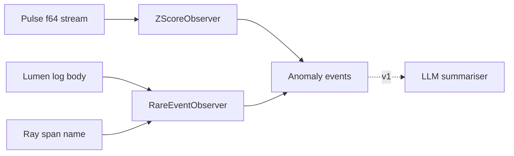

v0 &nbsp;·&nbsp; Cross-cutting analysis &nbsp;·&nbsp; AGPL-3.0 &nbsp;·&nbsp; Replaces <strong>Datadog Watchdog, New Relic AI</strong>

Augur is anomaly detection, and at v0 it is deliberately boring: classical
statistics, hand-rolled, no machine-learning stack at all. It watches telemetry
streams and emits a typed anomaly event when an observation crosses a threshold.
Included in the free product; bring your own model later if you want a fancier one.

## What it does

Augur ships two detectors at v0: a numeric z-score detector over metric streams,
and a categorical rare-event detector over log bodies and span names. Baselines
are per-tenant, one observer per signal. It is a library — no daemon, no network,
no persistence.

## How it works

Everything sits behind one generic trait, `AnomalyObserver<T>`, with a single
`observe` method returning an optional `Anomaly<T>`. The same shape is designed to
carry forward to multivariate, structural and embedding-based detectors later.

- **Z-score, by Welford (1962).** `ZScoreObserver` keeps an online mean and
 variance; after a warm-up window, an observation whose absolute z-score crosses
 the threshold fires, and a sustained shift adapts the baseline toward the new
 regime.
- **Rare events by frequency.** `RareEventObserver` keeps a frequency table and
 fires the first time an event's observed fraction falls at or below the rarity
 threshold.
- **No ML stack, on purpose.** No numpy, no scikit-learn, no embeddings, no LLM
 runtime. Augur depends on the tenant id type and the standard library, full
 stop. The point at v0 is a correct, cheap, explainable baseline behind a trait
 that a heavier detector can replace without changing callers.

## What works today

`ZScoreObserver::new(threshold, min_samples)` and
`RareEventObserver::new(rarity_threshold, min_samples)`, each emitting an
`Anomaly { tenant, value, score, observed_at, reason }`. The observe path is
O(1) per sample, so a detector is cheap to run inline alongside ingest. The value
carried on an anomaly is the exact value observed, so it lines up bit-for-bit with
what [Pulse](/components/pulse/) stored.

## Roadmap and limits

- **No ML at v0.** Bayesian online change-point detection, embedding clustering
 and LLM summarisation are named for v1, all behind the same one-method trait.
- **Stateless across restarts** — Augur holds its baselines in memory.

