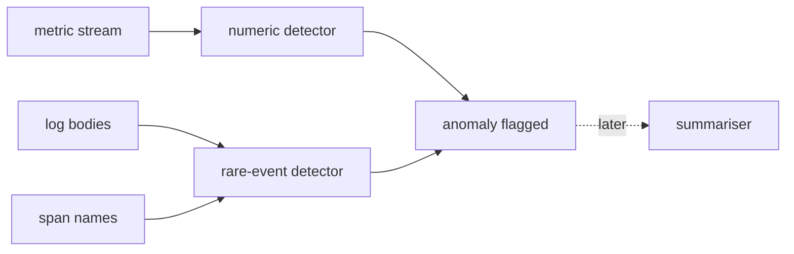

v0 &nbsp;·&nbsp; Cross-cutting analysis &nbsp;·&nbsp; AGPL-3.0 &nbsp;·&nbsp; Replaces <strong>Datadog Watchdog, New Relic AI</strong>

Augur is anomaly detection, and at v0 it is deliberately boring: plain classical
statistics, no machine-learning stack at all. It watches telemetry streams and
flags an anomaly when an observation crosses a threshold. Included in the free
product; bring your own model later if you want a fancier one.

## What it does

Augur ships two detectors at v0: one for numeric metric streams that flags values
far from the running normal, and one for categorical streams (log bodies, span
names) that flags rarely-seen events. Baselines are per tenant, one per signal. It
is a library — no daemon, no network, no stored state.

## How it works

- **The numeric detector** keeps a running mean and spread and flags an
  observation that sits too many standard deviations away, adapting if the new
  level holds.
- **The rare-event detector** keeps how often each value has been seen and flags
  one the first time it becomes rare enough.
- **No machine-learning stack, on purpose.** No numpy, no model runtime, no
  embeddings. The point at v0 is a correct, cheap, explainable baseline that a
  heavier detector can replace later without changing how it is used.

## What works today

The two detectors, each flagging an anomaly with the value, a score and a reason,
cheap enough to run inline alongside ingest. The value it flags is exactly the
value observed, so it lines up with what [Pulse](/components/pulse/) stored.

## Roadmap and limits

- **No machine learning at v0.** Change-point detection, clustering and
  LLM-written summaries are planned for a later version, behind the same simple
  interface.
- **State is in memory** — baselines do not survive a restart.
