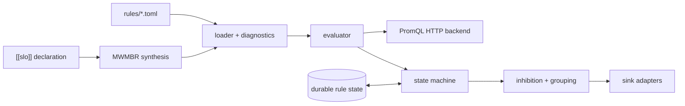

v1 &nbsp;·&nbsp; Integration plane &nbsp;·&nbsp; AGPL-3.0 &nbsp;·&nbsp; Replaces <strong>Datadog Monitors, New Relic Alerts, PagerDuty</strong>

Beacon is the part that watches the signals and decides when to wake a human. It
evaluates alert rules and SLO burn-rate rules against any OpenTelemetry-compatible
PromQL backend, collapses alert storms into single notifications, and — because
its rule state is durable — does not re-page the on-call engineer after a restart.

## What it does

Beacon loads a catalogue of rules, fetches each on its own interval, runs it
through a pure state machine, suppresses downstream alerts while an upstream cause
is firing, synthesises multi-window multi-burn-rate SLO alerts from a single SLO
declaration, and routes the resulting incidents to notification sinks. Its rule
state persists, so a firing alert stays firing across a restart.

## How it works

- **Two-crate workspace.** A pure library plus a thin `beacon-server`
 binary; the library has no runtime types in its public API.
- **Rules: CUE-shaped, TOML on the wire.** Rules are TOML on disk at v0 (the
 schema is CUE-shaped, because the Rust CUE ecosystem is not yet mature enough).
 The loader uses `deny_unknown_fields` and gives file, line and a "did you mean"
 suggestion on a bad rule. When [Loom](/components/loom/)'s CUE authority matures,
 it compiles CUE down to the same rule shape.
- **Pure state machine.** `Inactive → Pending → Firing → Resolved`,
 total over every input, evaluated against a scheduler seam.
- **Storm collapse.** A twenty-rule storm caused by one
 backend outage collapses to a single notification, then releases correctly when
 the upstream cause resolves. The behaviour is deterministic.
- **SLO synthesis.** One SLO declaration becomes exactly four
 PromQL alerts, byte-aligned to the Google SRE workbook's multi-window
 multi-burn-rate table, so you are paged only when the burn rate truly warrants
 it.
- **Durable rule state.** A keyed-latest-wins store — alert state is
 the current answer to a question, not a log of events — so a restart during an
 incident does not lose judgement. A corrupt state file makes the server refuse
 to start rather than start blind.
- **Hot reload.** On `SIGHUP` the new catalogue is built and validated
 completely before anything old is touched; a malformed edit keeps the previous
 rules with a refusal event, and a firing alert keeps its state across the swap.

## What works today

`beacon-server --rules <dir> --backend <url>` loads TOML rules, spawns a task per
rule, and emits incidents to four HTTP sinks: a generic webhook, Mattermost,
Zulip and Grafana OnCall. Header redaction is structural — a configured bearer
token never appears in a request body. See
[Alerting with Beacon](/operating/alerting/).

## Roadmap and limits

- **SMTP sink is deferred.** Four HTTP sinks ship; the design names SMTP but it is
 not in the shipped set.
- **Instant queries only at v0** for rule evaluation; range queries are later.
- **Native CUE authoring** arrives with Loom.

