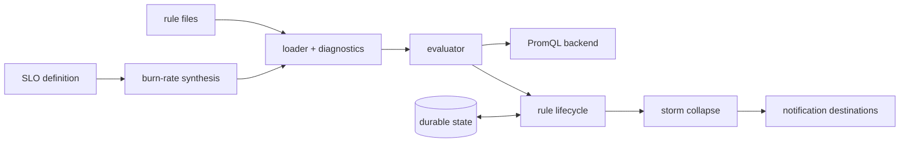

v1 &nbsp;·&nbsp; Integration plane &nbsp;·&nbsp; AGPL-3.0 &nbsp;·&nbsp; Replaces <strong>Datadog Monitors, New Relic Alerts, PagerDuty</strong>

Beacon watches the signals and decides when to wake a human. It evaluates alert
rules and SLO burn-rate rules against any OpenTelemetry-compatible PromQL backend,
collapses alert storms into single notifications, and — because its state is
durable — does not re-page the on-call engineer after a restart.

## What it does

Beacon loads a catalogue of rules, evaluates each on its own interval, moves each
rule through a simple lifecycle, suppresses downstream alerts while an upstream
cause is firing, turns a single SLO into the right set of burn-rate alerts, and
routes the resulting incidents to notification destinations. Its state persists,
so a firing alert stays firing across a restart.

## How it works

- **Rules are files on disk.** They are TOML at v0 (shaped to migrate to CUE
  later, when the tooling is ready). A typo does not silently disable a rule — you
  get the file, the line, and a "did you mean" suggestion. When
  [Loom](/components/loom/)'s authority matures, it will compile CUE into the same
  rules Beacon reads.
- **Storm collapse.** When one backend outage would otherwise trip twenty rules at
  once, Beacon collapses the storm to a single notification, then releases the
  suppressed alerts correctly when the cause resolves. The behaviour is
  deterministic.
- **SLO burn-rate.** One SLO definition becomes the multi-window multi-burn-rate
  alerts from the Google SRE workbook, so you are paged only when the burn rate
  truly warrants it.
- **Durable judgement.** Beacon's state persists, so a restart during an incident
  does not lose track of what is firing. A corrupt state file makes it refuse to
  start rather than start blind.
- **Hot reload.** On a reload signal, the new catalogue is built and checked
  completely before anything old is touched; a bad edit keeps the previous rules
  with a refusal notice, and a firing alert keeps its state across the swap.

## What works today

You point Beacon at a rules directory and a backend; it evaluates each rule and
sends incidents to four destinations: a generic webhook, Mattermost, Zulip and
Grafana OnCall. Configured secrets never appear in an outgoing message body. See
[Alerting with Beacon](/operating/alerting/).

## Roadmap and limits

- **No email (SMTP) destination yet.** Four HTTP destinations ship.
- **Instant queries only at v0** for rule evaluation; range queries are later.
- **Authoring in CUE** arrives with Loom.
