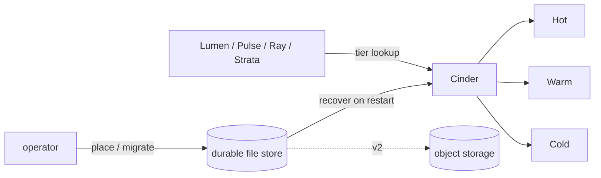

v1 &nbsp;·&nbsp; Storage plane &nbsp;·&nbsp; AGPL-3.0 &nbsp;·&nbsp; Replaces <strong>Datadog Flex Logs, S3 Archives</strong>

Cinder is the tiering governor. It does not store telemetry itself — the storage
pillars own that. Cinder records *where each item lives* (hot, warm or cold) and
moves items down the tiers as they age.

## What it does

For each tenant and item, Cinder records the current tier and when the item was
placed and last moved. It applies an age-based policy that decides when an item
should move down a tier, and at v1 it keeps this information durably.

## How it works

An in-memory version at v0 and a durable, file-backed version at v1, behind the
same contract. Crucially it stores only the placement information — which tier each
item is in — not the telemetry itself.

The lifecycle policy is a plain function of time: you give it a moment and the
ageing thresholds, and it tells you what should move, so the behaviour is
predictable and the operator's scheduler owns the clock. Durability is the shared
write-ahead-log-plus-snapshot machinery (see [Durability and Earned
Trust](/operating/durability/)), and a placement that cannot be persisted surfaces
an error rather than being acknowledged falsely.

The whole lifecycle is reachable from the CLI: place an item, look up its tier,
move it, list a tier, and run the ageing policy. See the [CLI
reference](/reference/cli/).

## What works today

Placing items, looking up and changing their tier, listing a tier, and running the
ageing policy, all durable across restart and all reachable from the CLI.
Tier transitions can be emitted to [Pulse](/components/pulse/) or to a file for
your collector.

## Roadmap and limits

- **The object-storage cold tier is v2.** Cinder records tiers today; the actual
  cold tier on S3, GCS or R2 lands at v2.
- **A scheduler that runs the ageing policy on a timer** is operator-owned future
  work; the policy itself is ready.
