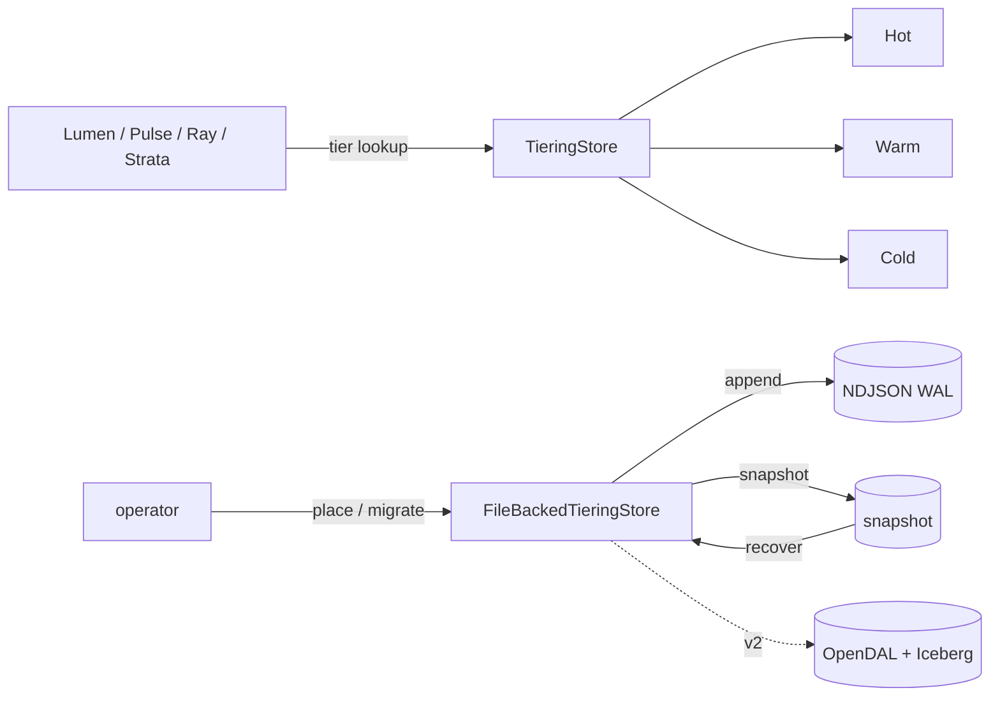

v1 &nbsp;·&nbsp; Storage plane &nbsp;·&nbsp; AGPL-3.0 &nbsp;·&nbsp; Replaces <strong>Datadog Flex Logs, S3 Archives</strong>

Cinder is the tiering governor. It does not store telemetry payloads — the storage
pillars own those bytes. Cinder records *where each item lives* (hot, warm or
cold) and moves items down the tiers as they age. It was the first feature in the
platform to survive a process restart.

## What it does

Cinder records, per tenant and item, the current tier and the timestamps of when
the item was placed and last migrated. It applies an age-based lifecycle policy
that decides when an item should move down a tier, and at v1 it persists this
metadata durably.

## How it works

A `TieringStore` trait with an in-memory v0 adapter and a durable file-backed v1
adapter. Crucially, it stores **metadata, not payloads**: the mapping
`(tenant, item) → (tier, placed_at, migrated_at)`.

- **Pure, simulated-time policy.** `TierPolicy::age_based(hot_to_warm,
  warm_to_cold)` is a value type, and `evaluate_at(now, policy)` is a pure function
  of the time you pass in — the operator binary owns the real timer. This keeps the
  lifecycle logic deterministic and testable.
- **Durability (v1).** The shared WAL-plus-snapshot machinery, with `place` and
  the policy evaluation made write-ahead-ordered and fallible so a persistence
  failure is surfaced rather than acknowledged falsely (ADR-0065). See
  [Durability and Earned Trust](/operating/durability/).
- **Operator surface.** The CLI exposes the full lifecycle: `place`, `get-tier`,
  `migrate`, `list-items` and `evaluate-policy`, with tier-distribution lines in
  `stats`. See the [CLI reference](/reference/cli/).

## What works today

`place`, `get_tier`, `migrate`, `list_by_tier` and `evaluate_at`, with typed
errors, durable across restart, all reachable from the CLI. Cross-process
observability bridges emit hot/warm/cold transitions to [Pulse](/components/pulse/)
and to an OTLP-JSON file.

## Roadmap and limits

- **The object-storage cold tier is v2.** Cinder stores tier *metadata* today; the
  S3 / GCS / R2 cold tier over OpenDAL and Iceberg lands behind the same trait at
  v2.
- **A real lifecycle timer** driving `evaluate_at` periodically is operator-owned
  future work; the evaluator itself is pure today.

## Key decisions

ADR-0059 (torn-tail recovery), ADR-0060 (store fsync durability), ADR-0065
(Cinder surfaces WAL persistence failures); observability bridges ADR-0038 and
ADR-0039.
