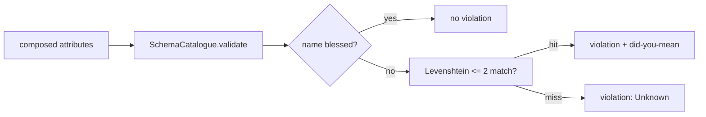

v0 &nbsp;·&nbsp; Integration plane &nbsp;·&nbsp; AGPL-3.0 &nbsp;·&nbsp; Replaces <strong>an ad-hoc tags taxonomy</strong>

Codex is the schema authority. It catches attribute typos at integration time,
before they ship and quietly fragment your data into `service.name` and
`servce.name`. It is a library, not a service: it holds a pinned corpus of blessed
attribute names and lints the attributes an application is about to emit.

## What it does

Codex exposes a single behavioural method, `SchemaCatalogue::validate`, which
checks a set of attribute name/value pairs against the OpenTelemetry semantic
conventions plus three Kaleidoscope house attributes — `tenant.id`,
`feature_flag.*` and `experiment.id`. For an unrecognised name it offers a fuzzy
"did you mean" suggestion. [Spark](/components/spark/) calls it at `init`, after
composing the resource and before constructing any OpenTelemetry types.

## How it works

- **The corpus.** A checked-in static slice of the pinned
 semantic-conventions attribute set, plus the three house attributes kept in a
 separate slice so a bad regeneration cannot drop them. An `xtask` regenerates
 the corpus from upstream when the pin moves, producing a visible PR diff.
- **In-tree Levenshtein.** A small two-row dynamic-programming matrix over
 characters, with the suggestion threshold locked at edit distance 2. No
 dependency is pulled in for it.
- **Default-warn, opt-in-strict.** The integration behaviour lives in Spark:
 default mode emits one warning per misconfigured init; strict mode returns an
 error so CI fails fast.
- **Zero runtime dependencies** beyond the standard library. The
 upstream semconv crate is used only by the regenerator, never at runtime.

## What works today

The five-type public surface is `SchemaCatalogue`, `BlessedAttribute`,
`LintReport`, `LintViolation` and `ViolationKind`. Blessed attributes come in
`Exact` and `Prefix` forms (so `feature_flag.checkout_v2` matches the
`feature_flag.` prefix, but a bare `feature_flag.` does not). The DELIVER wave
closed with 46 tests and every viable mutant caught. "v0" here means a shipped,
stable library — Codex stores nothing.

## Roadmap and limits

- **More match kinds** (regex, glob, version-pattern) and more violation kinds
 (deprecated, misnamed) are reserved by the non-exhaustive enums but not
 implemented.
- **No per-tenant overlays** and a single pinned semconv version at v0.

