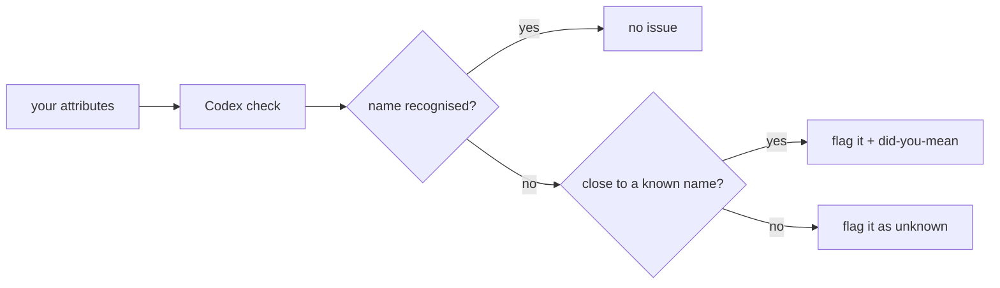

v0 &nbsp;·&nbsp; Integration plane &nbsp;·&nbsp; AGPL-3.0 &nbsp;·&nbsp; Replaces <strong>an ad-hoc tags taxonomy</strong>

Codex is the schema authority. It catches attribute typos at integration time,
before they ship and quietly split your data into `service.name` and
`servce.name`. It holds a known set of attribute names and checks the attributes
an application is about to emit against it.

## What it does

Codex checks a set of attribute names against the OpenTelemetry semantic
conventions plus three Kaleidoscope house attributes — `tenant.id`,
`feature_flag.*` and `experiment.id`. For an unrecognised name it offers a fuzzy
"did you mean" suggestion. [Spark](/components/spark/) runs this check when your
application starts, after composing the attributes and before any telemetry is
emitted.

## How it works

The known set is a checked-in copy of the pinned semantic-conventions attributes,
kept up to date by a tool that regenerates it from upstream when the version moves,
with the change visible in review. The house attributes are kept separately so a
bad regeneration cannot drop them. The "did you mean" suggestion is a simple
edit-distance match. Codex pulls in no runtime dependencies.

By default a problem produces a single warning per application start; in strict
mode it fails start-up instead, so a misconfiguration is caught in CI.

## What works today

The check runs at application start through Spark, in either warn mode (default)
or strict mode. House-attribute matching handles both exact names and the
`feature_flag.` prefix (so `feature_flag.checkout_v2` is recognised, but a bare
`feature_flag.` is not).

## Roadmap and limits

- **Richer matching** (patterns and globs) and **more problem kinds** (such as
  flagging deprecated names) are planned but not implemented.
- **No per-tenant overrides**, and a single pinned conventions version, at v0.
