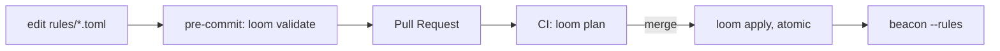

v0 &nbsp;·&nbsp; Integration plane &nbsp;·&nbsp; AGPL-3.0 &nbsp;·&nbsp; Replaces <strong>the Terraform Datadog provider</strong>

Loom puts Kaleidoscope's operational configuration under version control with a
Terraform-style workflow. At v0 it governs [Beacon's](/components/beacon/) rule
catalogue; the same pattern is designed to extend to sampling, dashboards and
policies later.

## What it does

Loom gives operators three commands — validate, plan and apply — that map onto
the three moments of a change: check before commit, review the diff in a pull
request, and apply atomically on merge. Diffs are deterministic and applies are
crash-safe and idempotent.

## How it works

- **`loom validate`** walks a directory, runs Beacon's loader, and maps the result
 to exit codes: `0` all good (an empty directory is also `0`, so a fresh team is
 not blocked), `1` a rule rejected, `2` the directory unreadable. Diagnostics go
 to stderr as `file:line: message`.
- **`loom plan`** computes a per-rule diff in pull-request shape (added, removed,
 changed, plus a summary), with `--diff` for per-field deltas. The output is
 byte-equal across runs — determinism comes from sorting in three places — so two
 reviewers see the same diff and CI never reports phantom drift.
- **`loom apply`** writes each file to a sibling temp, fsyncs and renames, so a
 crash leaves either the old file or the new one, never a half-written one. It is
 idempotent (a second run writes nothing), it preserves files it did not author,
 and a broken source blocks the whole apply.
- **`--json` output** carries a `loom.v0` schema tag, so a future `loom.v1` bumps
 the version and consumers reject a mismatch cleanly.

## What works today

The three commands, text output for pre-commit hooks and JSON for PR comments and
bots, with KPIs of feedback under 100 ms on a 50-rule corpus, byte-equal plans,
and idempotent applies. Loom v0 closed with 39 acceptance tests. See [Config as
code with Loom](/operating/config-as-code/).

## Roadmap and limits

- **Beacon rules only at v0.** Sieve sampling, Prism dashboards and Aegis policies
 are named to follow with the same pattern.
- **TOML, not yet CUE.** Migration to CUE is a parser swap behind the same
 workflow when the Rust CUE ecosystem matures.
- **The Git-backed authority** itself is a later deliverable; v0 operates on
 directories on disk.

