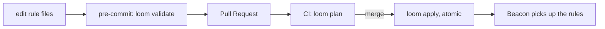

v0 &nbsp;·&nbsp; Integration plane &nbsp;·&nbsp; AGPL-3.0 &nbsp;·&nbsp; Replaces <strong>the Terraform Datadog provider</strong>

Loom puts Kaleidoscope's operational configuration under version control with a
Terraform-style workflow. At v0 it governs [Beacon's](/components/beacon/) rule
catalogue; the same pattern is designed to extend to sampling, dashboards and
policies later.

## What it does

Loom gives operators three commands — validate, plan and apply — that map onto the
three moments of a change: check before commit, review the diff in a pull request,
and apply atomically on merge. Diffs are deterministic and applies are crash-safe
and idempotent.

## How it works

- **validate** checks a rules directory and reports any problem with the file and
  line, returning a clear pass or fail for a pre-commit hook. An empty directory
  passes, so a team not yet writing rules is not blocked.
- **plan** shows a pull-request-style diff (added, removed, changed) that is
  byte-identical across runs, so two reviewers see the same thing and CI never
  reports phantom drift.
- **apply** writes changes atomically — a crash leaves either the old file or the
  new one, never a half-written one — is idempotent (a second run changes
  nothing), and never touches files it did not write. A broken source blocks the
  whole apply.

Both validate and plan can emit machine-readable output for posting as PR comments
or to a chat bot, alongside the plain text used by hooks.

## What works today

The three commands, with plain output for hooks and machine-readable output for
bots and PR comments. Plans are reproducible and applies are idempotent, so
reviews are stable and re-running an apply is safe. See [Config as code with
Loom](/operating/config-as-code/).

## Roadmap and limits

- **Beacon rules only at v0.** Sampling, dashboards and policies are designed to
  follow with the same pattern.
- **TOML, not yet CUE.** Migration to CUE is a swap behind the same workflow when
  the tooling is ready.
- **The Git-backed authority** itself is a later deliverable; v0 works on a
  directory of files.
