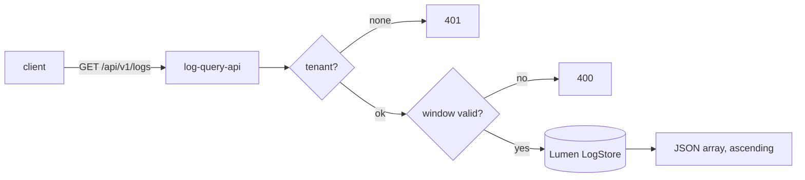

v1 &nbsp;·&nbsp; Storage plane &nbsp;·&nbsp; AGPL-3.0 &nbsp;·&nbsp; Replaces <strong>Datadog Logs, Splunk, Loki, Elastic</strong>

Lumen is the first-party log engine. It stores OTLP-shaped log records per tenant
and answers time-range and content queries over them, durably across a restart.

## What it does

Lumen ingests log batches, keeps records ordered by observed time, and answers
half-open time-range queries plus conjunctive filters: a service filter, a
severity floor, body substring and body regex. It exposes those over an HTTP read
API, and is the pillar the gateway writes logs into.

## How it works

A `LogStore` trait with an in-memory v0 adapter and a durable file-backed v1
adapter behind the same trait. Records are OTLP-shaped at the boundary — the
`LogRecord` mirrors the OpenTelemetry proto, including trace and span ids — so
there is no private projection to leak.

- **Durability (v1).** WAL-plus-snapshot, with the write-ahead log written per
  batch (one record per OTLP batch carries the whole vector inline). Recovery
  loads the snapshot then replays the log, tolerant of a single torn tail line.
  See [Durability and Earned Trust](/operating/durability/).
- **The read API (`log-query-api`).** `GET /api/v1/logs?start=&end=` returns a
  JSON array ascending in time. Optional filters compose conjunctively:
  `min_severity` (ADR-0052), `body_contains` (case-sensitive substring, ADR-0055),
  `body_regex` (linear-time RE2-derived engine, ADR-0056), and `limit`/`offset`
  pagination (ADR-0057). An empty window is a calm `200 []`; a malformed window is
  a `400` before the store is touched.
- **Shared read caps (ADR-0050).** A 24-hour window and a 100,000-row result cap,
  enforced by refusing rather than truncating. See [Read-side safety
  caps](/operating/read-caps/).

## What works today

Per-tenant ingest, time-range and predicate queries, and the full
`/api/v1/logs` surface above, durable across restart. The query parameters are
documented under [Query your telemetry](/getting-started/querying/) and the
[Query API reference](/reference/query-api/).

## Roadmap and limits

- **The shipped v1 is a file-backed WAL+snapshot store, not the columnar engine.**
  The Arrow + Parquet + DataFusion + Tantivy substrate is named but not yet
  implemented; queries are linear-scan today.
- **Pagination cannot exceed the result cap** — you narrow the window instead.

## Key decisions

ADR-0047 (read API contract), ADR-0050 (read caps), ADR-0052 (severity filter),
ADR-0055 (body substring), ADR-0056 (body regex), ADR-0057 (pagination), ADR-0054
(shared read-tier crate), ADR-0059 (torn-tail recovery), ADR-0060 (fsync
durability).
