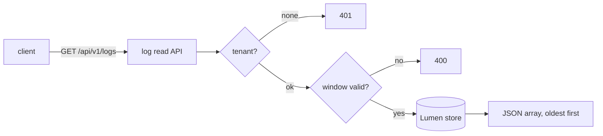

v1 &nbsp;·&nbsp; Storage plane &nbsp;·&nbsp; AGPL-3.0 &nbsp;·&nbsp; Replaces <strong>Datadog Logs, Splunk, Loki, Elastic</strong>

Lumen is the first-party log engine. It stores logs per tenant and answers
time-range and content queries over them, durably across a restart.

## What it does

Lumen ingests logs, keeps them ordered by time, and answers time-range queries
plus filters on service, severity floor, body substring and body regex. It serves
those over an HTTP read API, and is the pillar the gateway writes logs into.

## How it works

An in-memory version at v0 and a durable, file-backed version at v1, behind the
same contract. Records are kept in the OpenTelemetry shape at the boundary, so
nothing is lost in translation.

The durable version uses the platform's write-ahead-log-plus-snapshot approach
with real fsync and crash recovery (see [Durability and Earned
Trust](/operating/durability/)). The read API, `GET /api/v1/logs?start=&end=`,
returns the records in a window oldest-first, with optional filters that combine:
`min_severity`, `body_contains` (substring), `body_regex`, and `limit`/`offset`
for paging. An empty window is a calm empty result; a malformed window is rejected
before the store is touched. A 24-hour window cap and a 100,000-row result cap
apply, by refusing rather than truncating — see [Read-side safety
caps](/operating/read-caps/).

## What works today

Per-tenant ingest, time-range and filtered queries, and the full `/api/v1/logs`
surface above, durable across restart. The parameters are documented under [Query
your telemetry](/getting-started/querying/) and the [Query API
reference](/reference/query-api/).

## Roadmap and limits

- **The durable store is file-backed, not yet the columnar engine.** The columnar
  and full-text-index substrate is planned, not built; queries scan within the
  window today.
- **Paging cannot exceed the result cap** — you narrow the window instead.
