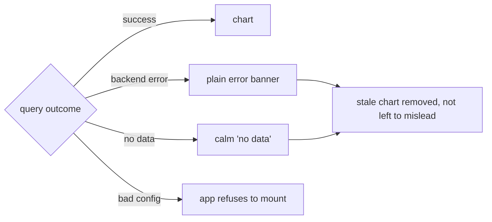

v0 &nbsp;·&nbsp; Integration plane &nbsp;·&nbsp; AGPL-3.0 &nbsp;·&nbsp; Replaces <strong>Datadog dashboards, New Relic One, Grafana</strong>

Prism is the frontend you look at. At v0 it is a deliberately focused single-page
app: one PromQL query panel against an OpenTelemetry-compatible metrics backend,
designed around a single job — an on-call engineer who needs to see the shape of a
misbehaving signal fast enough to triage.

## What it does

Prism plots a metric over a time window, with relative and absolute ranges,
auto-refresh, and every piece of state encoded in the URL so the view is shareable
in chat and reproducible in a postmortem. It is built for the 03:14 paged-SRE
persona, so its defining quality is that it stays calm and usable when things are
going wrong.

## How it works

Prism is a browser app built with React and Apache ECharts. Its hallmark is that
a failed query never blanks the page: each outcome has its own calm surface.

Three behaviours matter to an operator:

- **The chart never lies.** Data is drawn exactly as the backend returned it — no
  smoothing, no bridging gaps, no down-sampling — and a stale chart is removed the
  moment a query fails, rather than left next to an error banner.
- **Auto-refresh is steady.** It refreshes on an interval, backs off when the
  backend is failing, pauses when the tab is hidden, and turns itself off against a
  frozen absolute range. It never flickers.
- **The URL is the artefact.** The query, range and refresh are encoded in the
  link, and an absolute range reproduces the same chart days later — the basis of a
  postmortem permalink. Sensitive values from the backend configuration are
  redacted from anything shown on screen.

Prism went through a WCAG 2.2 AA accessibility pass: visible focus, adequate touch
targets, reduced-motion and high-contrast support, and an accessible table beside
the chart for assistive technology.

## What works today

Relative presets (5 min, 15 min, 1 h, 6 h, 24 h) and a custom absolute range;
steady auto-refresh; a small, fast bundle. Prism is served by the read API from
the same origin — point `KALEIDOSCOPE_QUERY_STATIC_DIR` at the built bundle and
there is no separate web server and no CORS. See [See it in
Prism](/getting-started/prism/).

## Roadmap and limits

Prism v0 is one metrics panel, not a dashboard builder. Deferred, each gated on
another component: a logs panel ([Lumen](/components/lumen/)), a traces panel and
click-through to exemplars ([Ray](/components/ray/), [Strata](/components/strata/)),
saved named dashboards ([Loom](/components/loom/)), and native authentication
([Aegis](/components/aegis/)).
