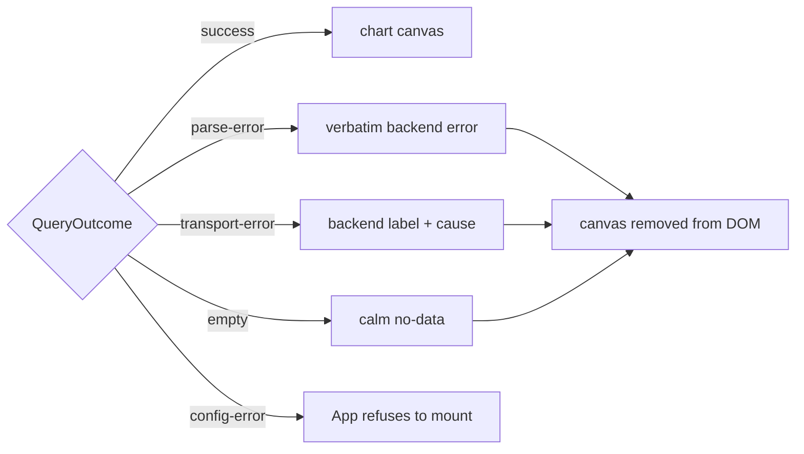

v0 &nbsp;·&nbsp; Integration plane &nbsp;·&nbsp; AGPL-3.0 &nbsp;·&nbsp; Replaces <strong>Datadog dashboards, New Relic One, Grafana</strong>

Prism is the frontend you look at. At v0 it is a deliberately focused
single-page app: one PromQL query panel against an OpenTelemetry-compatible
metrics backend, designed around a single job — an on-call engineer who needs to
see the shape of a misbehaving signal fast enough to triage.

## What it does

Prism renders a numeric timeseries chart for a PromQL query over a time window,
with relative and absolute ranges, auto-refresh, and every piece of state encoded
in the URL so the view is shareable in chat and reproducible in a postmortem. It
is built for the 03:14 paged-SRE persona, so its defining quality is that it stays
calm and usable when things are going wrong.

## How it works

Prism is a React 19 + Vite + Apache ECharts SPA in TypeScript, structured as a
modular monolith with internal ports and adapters; import discipline is enforced
structurally. Three pure functions anchor the design: the URL codec, the ECharts
option builder, and the auto-refresh reducer.

- **`queryRange` never throws.** Every failure becomes a `QueryOutcome`
 arm — success, empty, parse-error, transport-error, config-error — each with its
 own calm surface. A stale chart is *removed* from the DOM on any non-success
 outcome, never left next to an error banner to mislead.
- **Data fidelity is a hard rule.** The option builder disables smoothing,
 null-bridging and down-sampling; series data passes through verbatim, so the
 chart cannot lie about the underlying numbers.
- **Auto-refresh is a pure reducer.** A `(state, event) → (next,
 effects)` machine with backoff at 5/10/20 seconds capped at 30, pausing when the
 tab is hidden, and disabling itself against a frozen absolute range. A separate
 scheduler owns the real timers.
- **URL permalink.** State encodes to `q`, `from`, `to`, `refresh`.
 Absolute decoding does not depend on the wall clock, so the same URL reproduces
 the same chart days later — the basis of the postmortem permalink.
- **Accessibility.** A WCAG 2.2 AA pass: visible focus rings, adequate touch
 targets, reduced-motion and forced-colors support, and an accessible table
 beside the chart for assistive technology.

## What works today

Relative presets (5 min, 15 min, 1 h, 6 h, 24 h) plus a custom absolute range;
auto-refresh with backoff; header redaction so secrets never reach an
operator-visible string; a bundle measured at 222.5 KB gzipped against a 300 KB
ceiling. Prism is served by the read API from the same origin — point
`KALEIDOSCOPE_QUERY_STATIC_DIR` at the built bundle and there is no separate web
server and no CORS. See [See it in Prism](/getting-started/prism/).

## Roadmap and limits

Prism v0 is one metrics panel, not a dashboard builder. Deferred, each gated on
another component: a logs panel ([Lumen](/components/lumen/)), a traces panel and
click-through to exemplars ([Ray](/components/ray/), [Strata](/components/strata/)),
saved named dashboards ([Loom](/components/loom/)), and native auth
([Aegis](/components/aegis/)).

