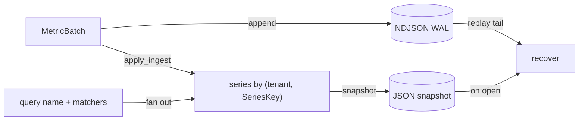

v1 &nbsp;·&nbsp; Storage plane &nbsp;·&nbsp; AGPL-3.0 &nbsp;·&nbsp; Replaces <strong>Datadog Metrics, New Relic Metrics, Cloud Monitoring</strong>

Pulse is the first-party metrics engine. It stores OTLP-shaped metric points per
tenant, queries them by time range and label, and — unlike the vendors — charges
nothing per metric: your cardinality is whatever your hardware supports.

## What it does

Pulse ingests metric batches (gauge and sum points at v0), keyed by tenant and by
the full identifying label set, and answers time-range queries with optional
service and label filters. At v1 the store is durable and survives a restart.
It is the engine the read API and [Prism](/components/prism/) query against.

## How it works

Pulse follows the [ports-and-adapters](/concepts/ports-and-adapters/) pattern: a
`MetricStore` trait with an in-memory v0 adapter and a durable, file-backed v1
adapter behind the same trait.

- **Series identity is the full label set.** A series is identified by
 tenant plus a `SeriesKey` of metric name and resource attributes. Before this,
 `http_requests_total` from `checkout` and from `cart` collided under one key and
 one overwrote the other; now they are distinct series and a query by name fans
 out across all of them. This is what lets the read API filter by
 `{service.name="checkout"}`.
- **Per-tenant cardinality watermark.** Each tenant gets a soft cap of
 10,000 series. Above it, a new label set is refused at ingest and counted, while
 existing series keep receiving points, so a noisy neighbour cannot starve a
 quiet one. The cap is a forward gate, never a retroactive eviction: a recovery
 rebuilds whatever was on disk.
- **Durability.** WAL-plus-snapshot with real
 `fsync`, atomic snapshots and torn-tail recovery, shared with the other pillars.
 See [Durability and Earned Trust](/operating/durability/).

## What works today

The public surface includes `MetricStore`, the in-memory and file-backed
adapters, the OTLP-shaped `Metric`, `MetricBatch`, `MetricKind` (gauge or sum),
`MetricPoint` and `TimeRange`, a `Predicate`, and `MAX_SERIES_PER_TENANT`.
Queries support a service filter and multiple label-equality filters. The metrics
read API (`/api/v1/query_range`) and label matchers are documented under
[Query your telemetry](/getting-started/querying/).

## Roadmap and limits

- **The shipped v1 is a file-backed WAL+snapshot store, not the columnar engine.**
 The Arrow + Parquet + DataFusion substrate and full PromQL are named but not yet
 implemented.
- **Gauge and sum only.** Histogram, exponential histogram and summary points are
 deferred to the columnar work.
- **`step` is not honoured** by the read API at v0 — you get raw in-window points,
 not a re-stepped grid.

