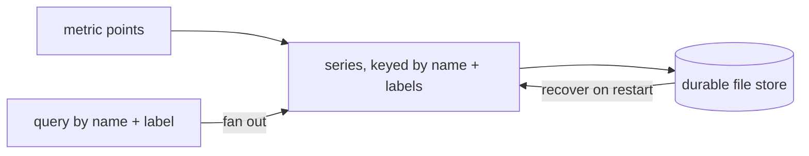

v1 &nbsp;·&nbsp; Storage plane &nbsp;·&nbsp; AGPL-3.0 &nbsp;·&nbsp; Replaces <strong>Datadog Metrics, New Relic Metrics, Cloud Monitoring</strong>

Pulse is the first-party metrics engine. It stores metrics per tenant, queries
them by time range and label, and — unlike the vendors — charges nothing per
metric: your cardinality is whatever your hardware supports.

## What it does

Pulse ingests metric points (gauges and counters at v0), keyed by tenant and by
their full set of identifying labels, and answers time-range queries with optional
service and label filters. At v1 the store is durable and survives a restart. It
is the engine the metrics read API and [Prism](/components/prism/) query against.

## How it works

Pulse follows the [ports-and-adapters](/concepts/ports-and-adapters/) pattern: an
in-memory version at v0 and a durable, file-backed version at v1, behind the same
contract.

- **A series is its full label set.** The same metric name from `checkout` and
  from `cart` are kept as distinct series rather than one overwriting the other, so
  a query can narrow to one service by label. This is what makes a filter like
  `{service.name="checkout"}` meaningful on the read API.
- **A cardinality cap per tenant.** Each tenant has a soft limit of 10,000 series.
  Above it, a brand-new label combination is refused at ingest and counted, while
  existing series keep receiving points — so a noisy neighbour cannot starve a
  quiet one. The cap only applies to new series during live ingest; a restart
  rebuilds whatever was already on disk.
- **Durable.** Write-ahead log plus snapshot, with real fsync and crash recovery,
  shared with the other pillars. See [Durability and Earned
  Trust](/operating/durability/).

## What works today

Per-tenant ingest of gauge and counter metrics, and queries by time range with a
service filter and label filters. The metrics read API (`/api/v1/query_range`) and
its label matchers are documented under [Query your
telemetry](/getting-started/querying/).

## Roadmap and limits

- **The durable store is file-backed, not yet the columnar engine.** The
  Arrow / Parquet / DataFusion substrate and full PromQL are planned, not built.
- **Gauges and counters only.** Histograms and summaries come with the columnar
  work.
- **`step` is not honoured** by the read API at v0 — you get the raw in-window
  points, not a re-stepped grid.
