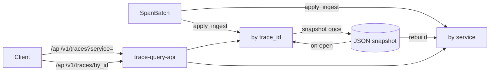

v1 &nbsp;·&nbsp; Storage plane &nbsp;·&nbsp; AGPL-3.0 &nbsp;·&nbsp; Replaces <strong>Datadog APM, New Relic Distributed Tracing, Tempo</strong>

Ray is the first-party trace store. It holds OTLP-shaped spans per tenant and
answers the two questions tracing actually asks: pull a whole trace by id, and
scan what a service was doing in a window. It charges nothing per span.

## What it does

Ray ingests span batches and indexes them on two axes at once — by trace id and
by service — so both the bedrock pull-by-trace-id query and the scan-by-service-
and-time query are fast. It serves both over an HTTP read API and is the pillar
the gateway writes traces into. At v1 it is durable across a restart.

## How it works

A `TraceStore` trait with an in-memory v0 adapter and a durable file-backed v1
adapter. The `Span` mirrors the OpenTelemetry proto in full — parent id, kind,
status, events, links, and both attribute maps — and ids serialise as lowercase
hex, the form every tracing tool prints.

- **Dual index.** A map by trace id and a map by service, each span cloned into
 both. The 2× memory buys O(1) lookup on both axes; the columnar v1 substrate is
 intended to collapse this.
- **One ingest routine, no drift.** A single `apply_ingest` inserts into both maps
 and is the only code that does so; live ingest, WAL replay and snapshot recovery
 all call it. The snapshot persists spans once and rebuilds the service index on
 open, so there is no second copy to fall out of step.
- **The read API (`trace-query-api`).** `GET /api/v1/traces?service=&start=&end=`
 returns the in-window spans for a service (the `service` parameter is required —
 missing or empty is a `400`); `GET /api/v1/traces/by_id?trace_id=<32-hex>` pulls
 a whole trace, returning a calm `200 []` for an unknown id, never a `404`.
- **Durability and read caps** are the shared platform machinery.

## What works today

Per-tenant ingest, `get_trace` by id, `(service, range)` scans, and predicate
queries on span name, kind and status, all durable across restart, exposed over
the two endpoints above. See [Query your telemetry](/getting-started/querying/).

## Roadmap and limits

- **The shipped v1 is a file-backed WAL+snapshot store, not the columnar engine.**
 The trace-id-partitioned columnar (Iceberg-on-Parquet) layout is named but not
 yet implemented.
- **Richer predicates and TraceQL** — span-event and link predicates, attribute-
 path matching — are deferred.

