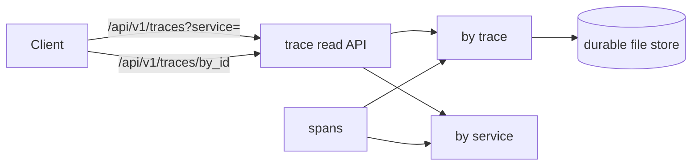

v1 &nbsp;·&nbsp; Storage plane &nbsp;·&nbsp; AGPL-3.0 &nbsp;·&nbsp; Replaces <strong>Datadog APM, New Relic Distributed Tracing, Tempo</strong>

Ray is the first-party trace store. It holds spans per tenant and answers the two
questions tracing actually asks: pull a whole trace by its id, and scan what a
service was doing over a window. It charges nothing per span.

## What it does

Ray ingests spans and indexes them so both questions are fast: fetch every span in
one trace by id, and list the spans for a service in a time range. Spans come back
oldest-first. It serves both over an HTTP read API and is the pillar the gateway
writes traces into. At v1 it is durable across a restart.

## How it works

An in-memory version at v0 and a durable, file-backed version at v1, behind the
same contract. Ray keeps two views of the data — one by trace and one by service —
so both lookups are direct; trace ids are shown as the lowercase hex strings every
tracing tool prints.

The two endpoints: `GET /api/v1/traces?service=&start=&end=` returns the spans for
a service in a window (the `service` parameter is required), and `GET
/api/v1/traces/by_id?trace_id=<32-hex>` returns a whole trace, with an unknown id
giving a calm empty result rather than a 404. Durability and the read caps are the
shared platform machinery (see [Durability and Earned
Trust](/operating/durability/) and [Read-side safety caps](/operating/read-caps/)).

## What works today

Per-tenant ingest, lookup by trace id, service-and-window scans, and filters on
span name, kind and status, durable across restart, served over the two endpoints
above. See [Query your telemetry](/getting-started/querying/).

## Roadmap and limits

- **The durable store is file-backed, not yet the columnar engine.** The
  trace-partitioned columnar layout is planned, not built.
- **Richer querying** — searching by span events, links or attributes, and a trace
  query language — is deferred.
