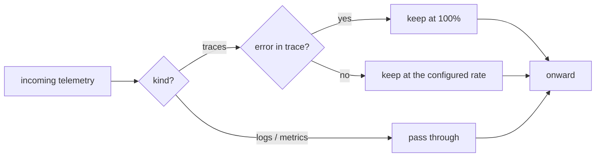

v0 &nbsp;·&nbsp; Integration plane &nbsp;·&nbsp; AGPL-3.0 &nbsp;·&nbsp; Replaces <strong>Datadog Live Search filters, Honeycomb Refinery</strong>

Sieve is volume control that keeps the data that matters. It samples traces, but
always keeps any trace that contains an error, so you can throttle routine noise
without losing the traces you actually need during an incident.

## What it does

Sieve makes a keep-or-drop decision per trace. Any trace containing an error span
is kept in full, regardless of the sampling rate. Other traces are kept at a
single configured rate, decided from the trace id so the same trace always gets
the same verdict across batches. Logs and metrics pass through untouched.

## How it works

Sieve sits inside Aperture's pipeline without changing how Aperture works: it
inspects the telemetry on its way through, keeps the traces it should, and passes
the rest along.

The sampling decision is deterministic: it comes from a stable hash of the trace
id, so the same trace is always kept or always dropped, and the error rule is
applied first so an error trace is never sampled away. Sieve also emits a periodic
summary of how much it kept and dropped.

## What works today

The keep rate for non-error traces is set by the environment variable
`SIEVE_NON_ERROR_TRACE_RATE` (default `0.1`, meaning 10% of non-error traces are
kept), and the summary interval by `SIEVE_SUMMARY_TICK_MS` (default 60000).

## Roadmap and limits

- **Tail sampling is a later version**; v0 decides at the head of the trace.
- **One global rate only** — no per-tenant or per-service rates yet.
- **No payload scrubbing** (for example, stripping sensitive fields) yet.
