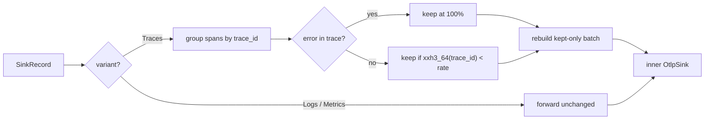

v0 &nbsp;·&nbsp; Integration plane &nbsp;·&nbsp; AGPL-3.0 &nbsp;·&nbsp; Replaces <strong>Datadog Live Search filters, Honeycomb Refinery</strong>

Sieve is volume control that keeps the data that matters. It samples trace data
head-based, but always keeps any trace that contains an error, so you can throttle
the routine noise without losing the traces you actually need during an incident.

## What it does

Sieve makes a keep-or-drop decision per trace. Any trace bearing a span with
`status.code == ERROR` is kept at 100%, regardless of the configured rate.
Non-error traces are kept at a single global rate, decided deterministically from
the trace id so the same trace always gets the same verdict. Logs and metrics
pass through untouched.

## How it works

Sieve is a library that **decorates** Aperture's existing sink rather than adding
a new hook, so Aperture's public surface does not move (ADR-0021).
`SamplingSink<S, N>` wraps any inner `OtlpSink` and is itself an `OtlpSink`.

- **Deterministic sampling (ADR-0018, ADR-0019).** The decision maps
  `xxh3_64(trace_id)` into `[0, 1)` and keeps the trace when that value is below
  the rate. The hash crate is pinned exactly, because its output is observable
  behaviour — a change would silently move which traces cross the boundary.
- **Error bias first.** The error rule runs before the rate rule, so an error
  trace is never dropped by sampling.
- **Periodic summary (ADR-0020).** Three atomic counters on the hot path feed a
  timer task that emits one summary line (`kept`, `dropped`, `rate`) per interval.

## What works today

The non-error rate is set by `SIEVE_NON_ERROR_TRACE_RATE` (default `0.1`, i.e.
10% of non-error traces kept); the summary interval by `SIEVE_SUMMARY_TICK_MS`
(default 60000). The public surface is `Sampler`, `Decision`, `KeepReason`,
`HeadSampler`, `SamplingSink`, `TraceView` and `SieveConfigError`. The DELIVER
wave closed with 36 tests at a 100% mutation kill rate.

The status label "v0" here means a shipped library behind a stable trait, not an
in-memory store.

## Roadmap and limits

- **Tail sampling is v1.** The `Sampler` trait is shaped so a future tail sampler
  drops in without changing the decorator.
- **One global rate only** — no per-tenant or per-service rates at v0.
- **PII / payload scrubbing** is deferred.
- The build journal describes Sieve as a decorator integrated against Aperture's
  sink trait; whether the shipped `kaleidoscope-gateway` binary switches sampling
  on in its default pipeline is a deployment choice rather than a fixed default.

## Key decisions

ADR-0018 (public API), ADR-0019 (dependency pinning), ADR-0020 (summary
aggregator), ADR-0021 (Aperture integration as a sink decorator).
