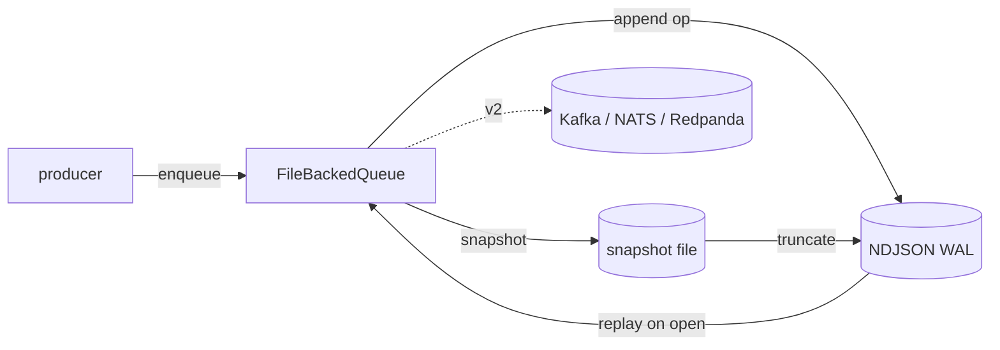

v1 &nbsp;·&nbsp; Integration plane &nbsp;·&nbsp; AGPL-3.0 &nbsp;·&nbsp; Replaces <strong>a vendor's internal queues</strong>

Sluice is the buffer that sits between sampling and storage. It is the queue port
of the platform: a place to hold telemetry batches so a burst of ingest does not
overwhelm the storage plane, with per-tenant ordering and at-least-once delivery.

## What it does

Sluice provides per-tenant FIFO queues keyed by tenant id, with at-least-once
semantics: acknowledging a message removes it; a negative acknowledgement returns
it to the head. Payloads are opaque bytes — Sluice is agnostic to what it carries.
Queues are bounded and surface backpressure as a typed `EnqueueError::Full`. At
v1 the queue is durable and survives a process restart.

## How it works

Sluice follows the platform's [ports-and-adapters](/concepts/ports-and-adapters/)
pattern: a `Queue` trait with two adapters. The v0 `InMemoryQueue` proved the
contract; the v1 `FileBackedQueue` makes it durable.

The durable shape is the platform-wide WAL-plus-snapshot pattern shared with the
storage pillars (see [Durability and Earned Trust](/operating/durability/)): each
operation appends to an NDJSON write-ahead log; an explicit snapshot compacts
state and truncates the log; recovery loads the snapshot then replays the
remaining log. Queue-specific invariants are preserved across restart: nack-to-
head ordering, the message-id counter resuming correctly, and in-flight messages
surviving a snapshot. The fsync, atomic-snapshot and torn-tail-recovery machinery
lives in the shared `wal-recovery` crate.

## What works today

The public surface is `Queue`, `InMemoryQueue`, `FileBackedQueue`, `Message`,
`MessageId`, `EnqueueError`, plus the `MetricsRecorder` observability seam. KPIs:
enqueue plus dequeue p95 under 50 µs in memory (v0); enqueue p95 under 300 µs and
recovery under 500 ms over 10,000 messages once durable (v1, debug build). v1
added one additive error variant, `EnqueueError::PersistenceFailed`.

## Roadmap and limits

- **External brokers are v2.** Kafka, NATS and Redpanda adapters are named to land
 behind the same `Queue` trait, but are not implemented.
- **Sieve is not yet wired to enqueue** through Sluice; that retrofit waited for
 durability to make queueing meaningful.

