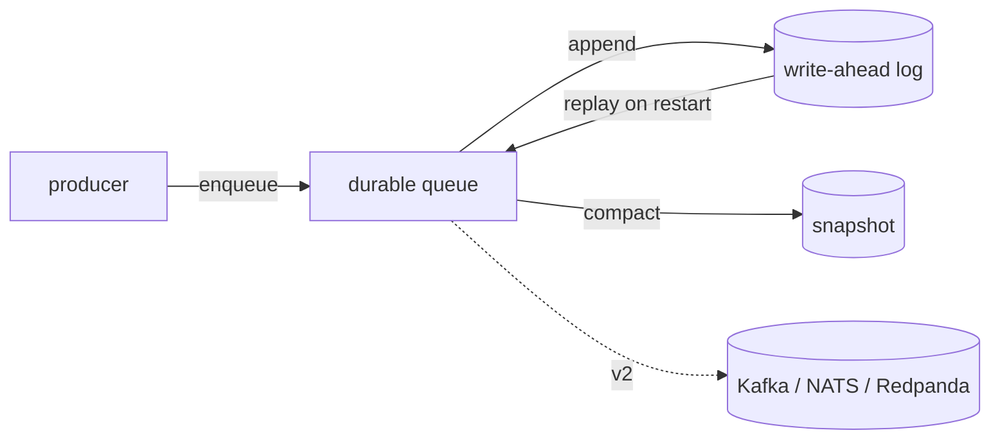

v1 &nbsp;·&nbsp; Integration plane &nbsp;·&nbsp; AGPL-3.0 &nbsp;·&nbsp; Replaces <strong>a vendor's internal queues</strong>

Sluice is the buffer between sampling and storage. It holds telemetry batches so a
burst of ingest does not overwhelm the storage plane, with per-tenant ordering and
at-least-once delivery. At v1 it is durable and survives a restart.

## What it does

Sluice gives each tenant its own first-in-first-out queue. A message is delivered
at least once: acknowledging it removes it, and a negative acknowledgement returns
it to the front. Queues are bounded, so when one is full the producer is told
clearly rather than silently losing data. It carries opaque bytes and is agnostic
to what they contain.

## How it works

Sluice is built on the platform's [ports-and-adapters](/concepts/ports-and-adapters/)
pattern: the same queue contract, with an in-memory version at v0 and a durable,
file-backed version at v1.

The durable version uses the platform-wide write-ahead-log-plus-snapshot approach
shared with the storage pillars (see [Durability and Earned
Trust](/operating/durability/)): each operation is logged before it takes effect,
a snapshot periodically compacts the log, and a restart replays the log to recover.
Ordering and in-flight messages are preserved across a restart.

## What works today

Per-tenant, bounded, at-least-once queues, durable across restart. A full queue
returns a clear "full" signal, and on the durable version a failed write surfaces
an error rather than acknowledging a message it did not store.

## Roadmap and limits

- **External brokers are v2.** Kafka, NATS and Redpanda will sit behind the same
  queue contract, but are not implemented.
- **Sieve is not yet wired to enqueue** through Sluice; that waited for durability
  to make queueing meaningful.
