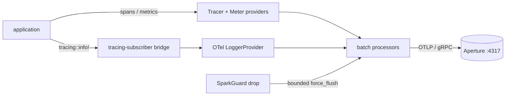

v0 &nbsp;·&nbsp; Integration plane &nbsp;·&nbsp; Apache-2.0 &nbsp;·&nbsp; Replaces <strong>Datadog / New Relic APM agents</strong>

Spark is the SDK your applications embed to emit telemetry. It is a thin,
manual-init wrapper over the upstream OpenTelemetry Rust SDK that injects
Kaleidoscope's house attributes, lints them at startup, and flushes cleanly on
shutdown. Because it is an SDK and not a per-host agent, there is no per-host
fee, ever.

It is licensed Apache-2.0 — unlike the AGPL platform components — precisely so it
can be embedded in proprietary application code without any copyleft obligation.

## What it does

On `init`, Spark builds the three OTLP signal pipelines (traces, logs, metrics)
sharing a single `Resource`, sets the OpenTelemetry global providers, wires a
logs bridge, and returns a guard. When the guard drops, pending exports are
flushed synchronously within a bounded deadline. The application keeps using
ordinary `tracing::info!` calls and the OpenTelemetry tracer and meter as usual.

## How it works

The entire public surface is **four items** — `init`, `SparkConfig`,
`SparkError`, `SparkGuard` — locked by ADR-0011. Spark deliberately does not
re-export upstream OpenTelemetry types, so the dependency edge stays visible and
renaming nothing leaks a breaking change.

A few decisions worth knowing:

- **Single-init invariant (ADR-0015).** A static atomic guards against
  double-initialisation; the flag is released when the guard drops, so
  init → drop → init cycles are allowed. The startup lint runs *before* the flag
  flips, so a configuration error never half-initialises the process.
- **Logs via the tracing bridge (ADR-0017).** The pinned OpenTelemetry SDK has no
  global logger-provider setter, so Spark wires
  `opentelemetry-appender-tracing` as a `tracing-subscriber` layer, filtered to
  exclude Spark's own diagnostics so telemetry never feeds back on itself.
- **Bounded flush (ADR-0014).** Each signal is flushed in turn against a
  remaining-time budget, default five seconds.
- **Schema lint at init (ADR-0025).** Spark calls [Codex](/components/codex/) to
  validate the composed attributes. Default mode warns once; strict mode
  (`with_strict_schema_lint(true)`) returns an error so CI fails fast.

## What works today

The `SparkConfig` builder offers `for_service`, `require_tenant_id`,
`with_tenant_id`, `with_feature_flags`, `with_experiment_id`, `with_endpoint`,
`with_flush_timeout` and `with_strict_schema_lint`. The only environment variable
Spark reads is the OpenTelemetry-canonical `OTEL_EXPORTER_OTLP_ENDPOINT`
(defaulting to `http://localhost:4317`); it introduces no `SPARK_*` variables of
its own. Transport at v0 is gRPC. The DELIVER wave closed with sixty active
tests across eight binaries at a 100% mutation kill rate.

A note on the status label: "v0" here means a shipped, stable, tested public
surface, not an in-memory store that loses data — Spark holds no state.

## Roadmap and limits

- **Auto-instrumentation is not in v0.** Spark is manual-init; automatic
  instrumentation is a later version.
- **Drained / dropped export counts** are not exposed, because the pinned
  OpenTelemetry SDK does not expose them; v0 records the honest literal
  `unknown` rather than building a throwaway counter.
- **Publication to crates.io** is post-v0; today the crate is in-tree only.

## Key decisions

ADR-0011 (public API), ADR-0012 (error type), ADR-0013 (dependency pinning),
ADR-0014 (flush timeout), ADR-0015 (single-init), ADR-0016 (guard posture),
ADR-0017 (logs emission), ADR-0025 (Codex integration).
