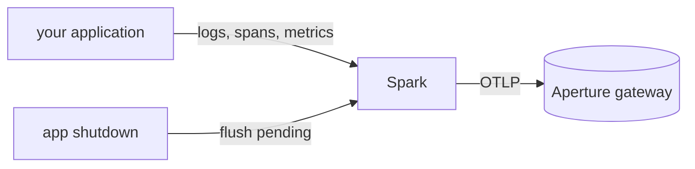

v0 &nbsp;·&nbsp; Integration plane &nbsp;·&nbsp; Apache-2.0 &nbsp;·&nbsp; Replaces <strong>Datadog / New Relic APM agents</strong>

Spark is the SDK your applications embed to emit telemetry. It is a thin,
manual-init wrapper over the upstream OpenTelemetry Rust SDK that adds
Kaleidoscope's house attributes, checks them at startup, and flushes cleanly on
shutdown. Because it is an SDK and not a per-host agent, there is no per-host fee,
ever.

It is licensed Apache-2.0 — unlike the AGPL platform components — precisely so it
can be embedded in proprietary application code without any copyleft obligation.

## What it does

You initialise Spark once at the start of your application and hold on to the
value it returns. From then on you emit telemetry exactly as you would with plain
OpenTelemetry — ordinary log lines, spans and metrics — and Spark ships it as OTLP
to the gateway. When your application shuts down, dropping the returned value
flushes anything still in flight, within a bounded deadline.

## How it works

All three signals (traces, logs and metrics) share a single description of your
service, so a log, a span and a metric from the same process carry the same
identity. Your existing log lines are bridged into the telemetry pipeline
automatically, so you do not change how you log.

Two behaviours worth knowing. Spark can only be initialised once per process, and
it checks your configuration before it takes effect, so a misconfiguration fails
cleanly at startup rather than half-initialising. And it never lets its own
internal diagnostics feed back into the telemetry it is exporting.

## What works today

At initialisation you can set the service name (required), an optional tenant id,
feature flags, an experiment id, the endpoint, the flush deadline, strict schema
checking, and a bearer token for an authenticated gateway. Spark reads the
standard OpenTelemetry environment variables `OTEL_EXPORTER_OTLP_ENDPOINT`
(default `http://localhost:4317`) and `OTEL_EXPORTER_OTLP_HEADERS`, and adds no
variables of its own. Transport at v0 is gRPC.

### Authenticating to the gateway

When [Aperture](/components/aperture/) requires ingest authentication, set a
bearer token in Spark's configuration and it is attached to every export. The
token is held so that it cannot be printed by accident, and Spark sends it as
given — it does not pre-check the token, so a rejected token surfaces as an export
error from the gateway. A token supplied through `OTEL_EXPORTER_OTLP_HEADERS`
takes precedence. With no token set, Spark sends no authentication header.

## Roadmap and limits

- **Auto-instrumentation is not in v0.** You initialise Spark by hand; automatic
  instrumentation is a later version.
- **Some export counters read as `unknown`** because the underlying
  OpenTelemetry SDK does not expose drained or dropped counts at the pinned
  version, and Spark reports the honest value rather than inventing one.
- **Not yet published to a package registry** — the SDK is in-tree for now.
