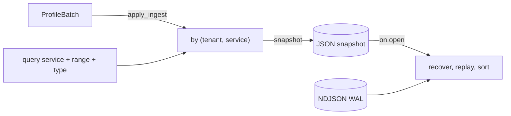

v1 &nbsp;·&nbsp; Storage plane &nbsp;·&nbsp; AGPL-3.0 &nbsp;·&nbsp; Replaces <strong>Datadog Profiler, New Relic code-level metrics</strong>

Strata is the fourth signal pillar: profile storage. It holds pprof-shaped
profiles per tenant and service and answers time-range and profile-type queries,
durably across a restart. It is a passive sink — it stores profiles handed to it;
it does not yet scrape them.

## What it does

Strata ingests profile batches and keeps them ordered by time per service, and
answers `(service, range)` queries with an optional profile-type filter. Profiles
are the heaviest objects the platform stores — a full string table, function,
mapping and location index, plus samples — so batches are small.

## How it works

A `ProfileStore` trait with an in-memory v0 adapter and a durable file-backed v1
adapter. The `Profile` mirrors the pprof shape; because the model is fully
structured with no raw byte field, it round-trips through plain serialisation —
the heaviest payload needed the lightest durability machinery of the six pillars.

- **Single index.** A map keyed by tenant and service, since both v0 queries hit
  the service axis — no need for [Ray's](/components/ray/) dual index.
- **One ingest routine** serves the live path and recovery, so they cannot drift;
  it keeps the v0 rule of dropping profiles with no service name from the index.
- **Durability** is the shared WAL-plus-snapshot machinery with real fsync and
  torn-tail recovery (ADR-0059, ADR-0060). The KPIs held at first measure with no
  delivery-time adjustment — by the sixth pillar the pattern was settled.

## What works today

Per-tenant, per-service ingest and `(service, range)` queries with a
`profile_type` filter (`cpu`, `heap`, `goroutine`), durable across restart.

## Roadmap and limits

- **No read API yet.** Unlike logs, metrics and traces, profiles do not yet have
  an HTTP read endpoint, and profiles are not in the gateway's storage-sink path.
- **Passive sink only.** Continuous profile scraping is roadmap, not shipped.
- **The shipped v1 is a file-backed WAL+snapshot store.** The columnar substrate
  and symbolisation (gimli/addr2line) are named but not implemented, and v1 will
  align with the OpenTelemetry Profiles signal as it stabilises upstream.
- **Sample, location and function predicates** are deferred — only `profile_type`
  filtering exists today.

## Key decisions

Strata has no component-specific ADR; its design history lives in its feature
wave-decisions. It inherits the shared durability ADRs: ADR-0059 (torn-tail
recovery), ADR-0060 (store fsync durability).
