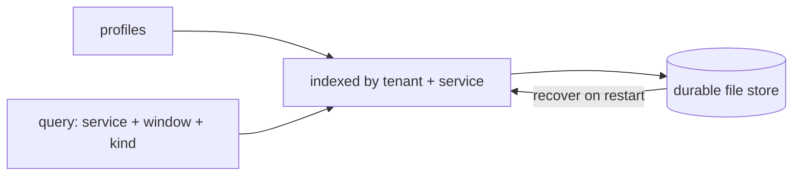

v1 &nbsp;·&nbsp; Storage plane &nbsp;·&nbsp; AGPL-3.0 &nbsp;·&nbsp; Replaces <strong>Datadog Profiler, New Relic code-level metrics</strong>

Strata is the fourth signal pillar: profile storage. It holds profiles per tenant
and service and answers time-range and profile-type queries, durably across a
restart. It is a passive sink — it stores profiles handed to it; it does not yet
scrape them.

## What it does

Strata ingests profiles in the standard pprof shape, keeps them ordered by time
per service, and answers queries for a service over a window with an optional
filter on the kind of profile. Profiles are the heaviest objects the platform
stores, so batches are small.

## How it works

An in-memory version at v0 and a durable, file-backed version at v1, behind the
same contract.

Durability is the shared write-ahead-log-plus-snapshot machinery with real fsync
and crash recovery (see [Durability and Earned Trust](/operating/durability/)).
Because a profile is fully structured, it stores and recovers without any special
handling.

## What works today

Per-tenant, per-service ingest, and queries for a service over a window with a
filter on profile kind (such as CPU, heap or goroutine), durable across restart.

## Roadmap and limits

- **No read API yet.** Unlike logs, metrics and traces, profiles do not yet have
  an HTTP endpoint, and profiles are not in the gateway's storage path.
- **A passive sink only.** Continuous profile scraping is roadmap, not shipped.
- **The durable store is file-backed**; the columnar substrate and symbol
  resolution are planned, and the engine will track the OpenTelemetry Profiles
  signal as it stabilises.
- **Filtering is by profile kind only** today.
