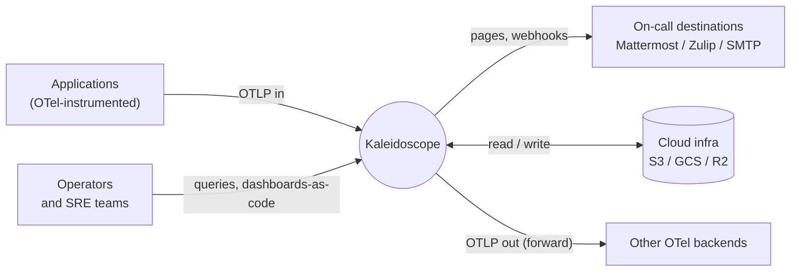
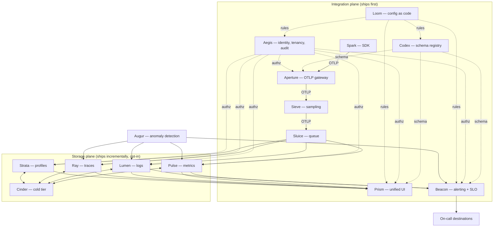

Kaleidoscope is described in three views that build on each other, plus an
explicit phasing layer that says which parts ship first. This page is the map;
the [two planes](/concepts/two-planes/), the [fifteen
instruments](/concepts/instruments/) and [ports and
adapters](/concepts/ports-and-adapters/) pages zoom into each part.

## View 1 — System context

What Kaleidoscope is at its boundary.



The boundary is OpenTelemetry. Applications emit OTLP. Operators query and
configure. Cloud storage holds telemetry data. On-call destinations receive
alerts. Kaleidoscope can also forward OTLP downstream so it integrates with
anything OTel-compatible.

## View 2 — Container view with port boundaries

The components, the OTLP wire contracts between them, and the port boundaries to
external-service adapters.



Solid arrows are OTLP signal flows. Dotted arrows are cross-cutting concerns —
schema, identity, configuration. The integration plane (top) is what ships first
and is useful by itself on top of any OTLP-compatible backend you already run.
The storage plane (middle) ships incrementally, and each storage component is
opt-in when it lands.

## View 3 — Architectural strata

Five layers, ordered by how Kaleidoscope-specific they are.

```
┌──────────────────────────────────────────────────────────────────┐
│              Kaleidoscope components (first-party code)             │
│   Spark · Aperture · Sieve · Sluice · Codex · Pulse · Lumen ·      │
│   Ray · Strata · Cinder · Prism · Beacon · Aegis · Loom · Augur    │
├──────────────────────────────────────────────────────────────────┤
│                    Ports (interfaces + tests)                      │
│   queue · embedded KV · transactional KV · authz · secrets ·       │
│   federation broker · object storage · query engine · schema       │
├──────────────────────────────────────────────────────────────────┤
│       Adapters (today: FOSS; tomorrow: Kaleidoscope-native)        │
│   NATS JetStream · RocksDB · FoundationDB · SpiceDB · OpenBao ·     │
│   Dex · OpenDAL → S3 / GCS / R2 · DataFusion · CUE                 │
├──────────────────────────────────────────────────────────────────┤
│         Substrate (foundation libraries; not behind a port)        │
│   Apache Arrow · Parquet · Iceberg · DataFusion · Tokio ·          │
│   Hyper · Tonic · Protobuf · pprof · OTLP                          │
├──────────────────────────────────────────────────────────────────┤
│              Runtime (language-level, not replaceable)              │
│   Rust std · Go std                                                 │
└──────────────────────────────────────────────────────────────────┘
```

A **component** is first-party Kaleidoscope code. A **port** is an interface
plus its conformance test vectors — the swap point where a dependency can be
replaced. An **adapter** is a concrete implementation of a port. **Substrate**
libraries are so foundational, with so little re-licensing risk under Apache
Foundation governance, that they are exempt from the port discipline.
**Runtime** is the language platform itself.

The upper three layers are where Kaleidoscope's differentiation lives. The lower
two are the soil.

## What the model commits to

1. Kaleidoscope is **integration plane plus storage plane plus cross-cutting
   analysis** — three concentric layers of differentiation.
2. The integration plane is **shippable first** and useful from day one, paired
   with any OTel-compatible backend you already run.
3. Each storage engine is **opt-in** when it ships. You migrate when you choose;
   Kaleidoscope coexists with your existing stack until you are ready.
4. **Every external dependency hides behind a port.** The day a dependency
   misbehaves, the adapter swaps; the component code stays.
5. **Substrate is locked at the Apache Foundation level**, exempt from port
   discipline because its re-licensing risk is structurally near-zero.
