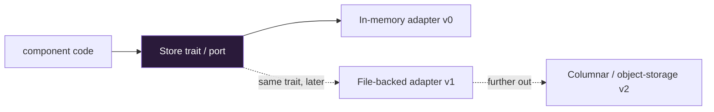

Kaleidoscope's resilience to both technical and commercial risk comes from one
discipline applied everywhere: **every external dependency hides behind a port.**
A port is an interface plus a conformance test suite. An adapter is a concrete
implementation of that port. Component code talks to the port, never to the
dependency.

## Why this exists

Two reasons, one technical and one commercial.

Technically, the day RocksDB, FoundationDB, SpiceDB or any other dependency
misbehaves, the adapter swaps and the component code stays. The conformance
tests guarantee the replacement honours the same contract.

Commercially, it is the same protection at the dependency level that the licence
provides at the project level. If a dependency re-licenses, Kaleidoscope writes a
new adapter behind the same port rather than being captured.

## The v0 → v1 pattern in practice

This is the part that matters most for an adopter trying to read the status
honestly. Almost every Kaleidoscope component shipped first as a **v0** with an
**in-memory adapter** behind a stable trait, and then grew a **v1** with a
**durable, file-backed adapter** behind the *same* trait.

The v0 adapter establishes the contract; the v1 adapter keeps the same contract
while adding durability; a future v2 (columnar storage, object-storage cold tier)
will keep it again while adding scale. Each step is additive — moving from v0 to
v1 changes the adapter behind the trait, not the trait itself, so code that used
the in-memory store works unchanged against the durable one.

Six storage pillars have made this v0-to-v1 round trip — tier metadata, queue,
logs, metrics, traces and profiles — across six different data shapes, so the
carry-forward is a property you can rely on, not a one-off.

## The strata, restated as swap points

| Layer | What it is | Swap discipline |
| --- | --- | --- |
| Component | First-party Kaleidoscope code | Never swapped; this is the product |
| Port | Interface + conformance tests | The stable contract |
| Adapter | Concrete implementation | Swappable: in-memory → file-backed → columnar → object storage |
| Substrate | Apache-Foundation libraries | Exempt from port discipline; re-licensing risk near zero |
| Runtime | Rust std / Go std | Not replaceable |

## What this means for you

When you read that a component is "v0", it means the trait and behaviour are
locked and tested, but the shipped adapter keeps state in memory. When you read
"v1", a durable file-backed adapter exists behind that same trait. The
[component status table](/reference/components/) uses exactly these words, and
the [durability page](/operating/durability/) explains how the durable adapters
prove they actually persist.
