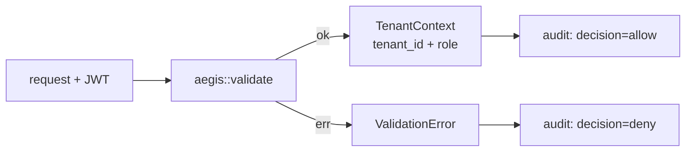

Every signal in Kaleidoscope is scoped to a tenant. This is not an enterprise
add-on bolted on later; it is threaded through the storage traits from the start.
A single shared `TenantId` type passes to every store with no conversion, and a
cross-crate test fails at compile time if that type ever drifts. The platform is
designed to keep one tenant's data sealed off from another's by construction.

## Where tenant identity comes from

OTLP has no native tenant concept, so Kaleidoscope resolves the tenant
explicitly. At the gateway, ingest is authenticated (`aegis-ingest-auth-v0`): the
tenant comes from the **validated JWT's tenant context**, so an accepted record
is tagged with the tenant that authenticated it — a type-level guarantee carried
through the pipeline, never a default or a guess. A request that does not
authenticate stores nothing. The read APIs resolve tenancy the same way and fail
closed: an unresolved tenant is refused rather than answered with someone else's
data. (Read-path tenant authority is deferred to a later feature.)

## What Aegis provides at v0

Aegis is the identity component: authentication, authorization, multi-tenancy
and audit. Its v0 is deliberately minimal but real.

At v0, Aegis ships:

- **JWT validation** with the issuer and JWKS pre-loaded, so there is no network
  call at validation time.
- **A tenant catalogue** loaded from TOML, with duplicate-id rejection and O(1)
  membership checks. A FoundationDB-backed catalogue is a later version.
- **Two roles**, `viewer` and `operator`. Full policy-based RBAC is a later
  version.
- **An audit log** emitted as stable `tracing` events, so every validation
  decision is recorded. Your subscriber routes those events to Lumen once you run
  it.

## What is roadmap

The heavier identity machinery — SPIFFE/SPIRE workload identity, OPA policy,
Dex/Keycloak federation, OpenBao secrets, a FoundationDB-backed catalogue — is
all explicitly v1 or later. Aegis v0 is the trait and the minimal honest
implementation behind it, in keeping with the [ports and
adapters](/concepts/ports-and-adapters/) pattern.

Aegis is adopted by its consumers one at a time rather than all at once. The
first is **Aperture's ingest path**, which now requires a validated HS256 JWT for
every
OTLP request and refuses to start without an auth block — see [Run the gateway
end to end](/getting-started/gateway/). Beacon and Prism are still to follow.
Check the [component status table](/reference/components/) for where each one is.
