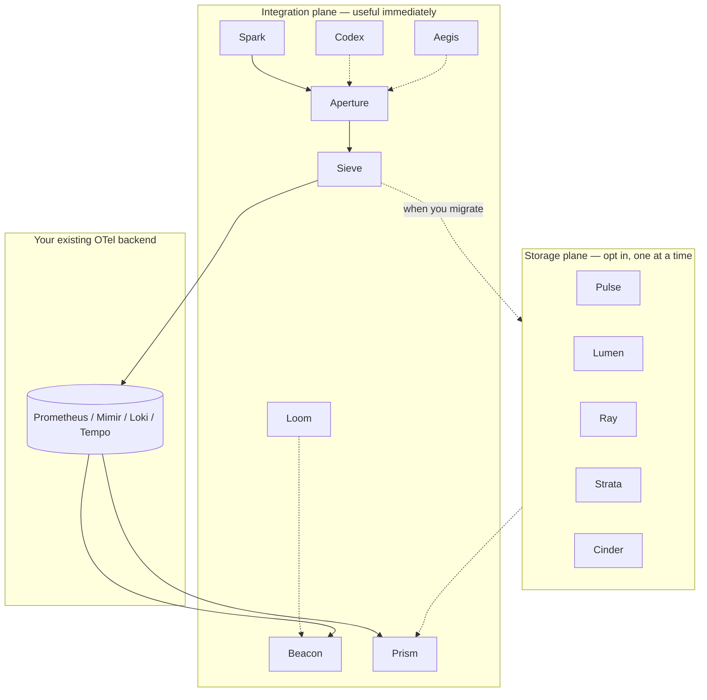

The single most important structural decision in Kaleidoscope is the split into
two planes. It is what makes the platform usable long before it is finished, and
it shapes how you adopt it.

## Integration plane

The parts users touch first: the SDK, the gateway, sampling, schema, identity,
alerting, dashboards, and config-as-code. This plane is useful immediately on
top of **any existing OTLP-compatible backend**. You can route telemetry through
Aperture, alert on it with Beacon, manage rules with Loom, and view it in Prism,
while your data still lives in whatever store you run today.

## Storage plane

The parts that replace the backend: first-party engines for logs, metrics,
traces and profiles, plus the tiering governor. This plane ships afterwards, one
engine at a time, and each engine is **opt-in** when it lands. You migrate off
Loki, Mimir, Tempo or Pyroscope when you choose, not all at once, and not before
you trust the replacement.

## Why the split matters

Most observability rewrites die because the storage engines are decade-class
engineering, and nothing useful ships until they are done. Splitting the planes
means the integration plane delivers a usable platform first, on top of a backend
you already trust. The hardest engineering — the storage engines — arrives only
after the easier work has proved the approach.

For you as an adopter, this means there is no big-bang migration. You can start
by putting the integration plane in front of your current backend, get value
from better alerting, schema validation and a calmer triage UI, and only later
move individual signals into Kaleidoscope's own engines as each one matures.

## Cross-cutting analysis

Sitting across both planes is Augur, the anomaly-detection component. It reads
from the storage plane (or your existing backend) and feeds findings to Beacon.
At v0 it is deliberately simple — classical statistics, no ML stack — with a
generic trait that later versions extend without changing the shape.

## Where adoption starts today

Because the integration plane is the part designed to be useful first, and
because the storage plane already has durable v1 adapters behind every trait, a
realistic evaluation today runs the gateway into the durable stores locally and
views metrics in Prism. See [Run the gateway end to
end](/getting-started/gateway/) and the [component status
table](/reference/components/) for exactly how far each plane has come.
