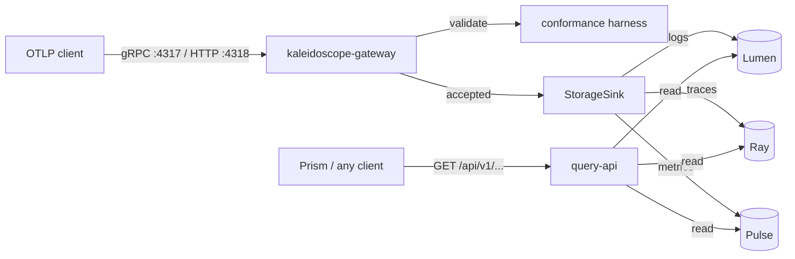

This is the full pipeline: an OTLP client sends telemetry over the network, the
gateway validates and persists it into the durable pillars, and the read APIs
serve it back. It is the first configuration in which Kaleidoscope behaves as a
platform rather than a library.

## The shape of the loop



## What the gateway does

The `kaleidoscope-gateway` binary listens for OTLP over gRPC on `:4317` and over
HTTP/protobuf on `:4318`. Every incoming payload is validated against the
conformance harness before anything else happens. Accepted payloads are handed
to a `StorageSink`, which translates each signal into its pillar's shape and
persists it: **logs to Lumen, traces to Ray, metrics to Pulse**. Because those
stores are the durable v1 adapters, a span sent to `:4317` is queryable out of
Ray even after a restart.

### Honest behaviour at the seams

The translation layer is deliberately strict, because half-storing telemetry is
worse than refusing it:

- **All-or-nothing translation.** A wrong-length trace id refuses the whole
  batch rather than storing a corrupted id.
- **Authenticated tenancy.** OTLP has no native tenant concept. The gateway now
  derives the tenant from the validated ingest token (see below), so an accepted
  record is tagged with the tenant that authenticated it — never a default or a
  guess. That tenant flows through the pipeline, and sampling preserves it.
- **Skip what cannot be represented.** Metric types Pulse cannot yet hold
  (histograms, summaries) are skipped with an observable event, never silently
  costing you the supported points beside them.

The rule throughout: skip what you cannot represent, refuse what you cannot
trust, never split the difference silently.

## Authentication is mandatory

As of `aegis-ingest-auth-v0`, the gateway authenticates **every** OTLP ingest
request against an Aegis HS256 JWT validator before the body reaches any sink,
fail-closed end to end. There is no off switch: a gateway with a missing,
incomplete or unreadable auth block **refuses to start** (exit code `2`, event
`config_validation_failed`, naming the offending field) and binds nothing.

Configure it with a complete `[aperture.security.auth.jwt]` block:

```toml
[aperture.security.auth.jwt]
issuer = "acme-observability"
audience = "kaleidoscope-ingest"
secret_file = "/path/to/hs256.secret"     # the HS256 signing key, read once at startup, never logged
catalogue_path = "/path/to/tenants.toml"  # the Aegis tenant catalogue
```

Clients then present a bearer JWT — as the `Authorization: Bearer <jwt>` header
over HTTP, or `authorization` metadata over gRPC. The token is HS256-signed with
the configured secret and must carry `iss` and `aud` matching the config, a
`tenant_id` present in the catalogue, a `kaleidoscope_role` (`viewer` or
`operator`), and a future `exp`.

A rejected request stores nothing: gRPC returns `Status::unauthenticated`, HTTP
returns `401` with a `WWW-Authenticate: Bearer` challenge, and the body is never
re-encoded or handed to a sink. Exactly one allow/deny line is audited per
request.

## Send some telemetry

Point any OpenTelemetry SDK or the OpenTelemetry Collector's OTLP exporter at the
gateway's endpoints, with the bearer token configured on the exporter. From an
application instrumented with the Kaleidoscope SDK (Spark) or any OTel SDK, set
the OTLP endpoint to your gateway host, attach the `Authorization: Bearer <jwt>`
header, and emit a span, a metric, or a log as usual.

A minimal smoke test is to run the gateway with an auth block configured, send
one span over gRPC with a valid bearer token, and then read it back through the
trace API (next section).

## Read it back

The read side is served by the `query-api` binary and its siblings. Metrics come
back in Prometheus shape; logs and traces as JSON arrays.

```sh
# metrics (Prometheus-shaped matrix)
curl 'http://localhost:9090/api/v1/query_range?query=http_requests_total&start=...&end=...&step=15'

# logs for a tenant and window
curl 'http://localhost:9090/api/v1/logs?start=...&end=...'

# spans for a tenant, service and window
curl 'http://localhost:9090/api/v1/traces?service=checkout&start=...&end=...'

# a single trace by id
curl 'http://localhost:9090/api/v1/traces/by_id?trace_id=<32-hex>'
```

Tenancy is resolved the same way on the read side; an unresolved tenant is
refused fail-closed rather than answered with someone else's data. See the
[Query API reference](/reference/query-api/) for the exact contract.

## Serve Prism from the same origin

`query-api` can serve Prism's built bundle and its `config.json` alongside its
own routes, behind a switch that is off by default. Point
`KALEIDOSCOPE_QUERY_STATIC_DIR` at `apps/prism/dist` and the whole read side runs
from one binary — no separate web server, no CORS. See
[See it in Prism](/getting-started/prism/).

## The honest caveat

This is a single-process, local pipeline. It is genuinely end to end — ingest,
store, query, see — but it is not a multi-node, highly-available deployment.
Treat it as an evaluation and development setup, and read
[Honest limitations](/operating/limitations/) before you plan anything larger.
