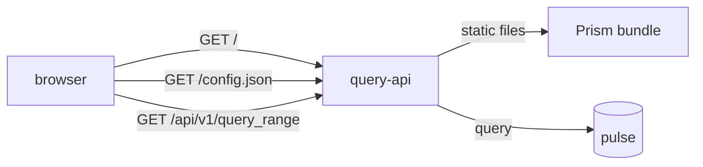

Prism is Kaleidoscope's query and visualisation frontend — its answer to
Grafana dashboards or the Datadog metrics explorer. At v0 it is a focused
single-page app with two views, switched from an accessible nav: a metrics query
panel at `/`, and a trace explorer at `/traces` that finds failed traces and
shows their spans and correlated logs on one screen. Both are built for the same
job — an operator triaging an incident.

## The persona it was built for

Prism v0 was designed around one job, deliberately narrow: an SRE paged at
03:14 who has five minutes to triage. Everything in it serves "see the shape of
the misbehaving signal fast enough to decide what to do next" — rollback, scale,
hand over, or declare an incident.

That focus shows up as restraint. The page does not blank on you when a query
fails; every outcome — success, empty, parse error, transport error — gets its
own calm surface, and the URL keeps encoding even the broken state so you can
paste it into Slack and a colleague sees exactly what you saw.

## Run it from one origin

The cleanest way to run Prism is to let the read API serve it. `query-api` can
serve Prism's built bundle and its `config.json` from the same origin as its own
query routes, so there is no separate web server and no CORS to configure.

```sh
# build the Prism bundle
cd apps/prism
pnpm install
pnpm build      # output lands in apps/prism/dist

# serve it from the read API
KALEIDOSCOPE_QUERY_STATIC_DIR=apps/prism/dist ./target/release/query-api
```

The switch is off by default, so the shipped backend is the same read-only
service unless you point it at a built bundle. Route precedence is handled for
you: an exact API route always wins over the static fallback, and an unknown
path falls through to Prism's `index.html` so the SPA can route it client-side.



## What you can do in it today

Prism v0 gives you a query panel with relative range presets (last 5 min, 15
min, 1 h, 6 h, 24 h), a custom absolute range with a permalink that reproduces
the exact window days later, and auto-refresh with sensible backoff that pauses
when the tab is hidden and never flickers. It went through a WCAG 2.2 AA
accessibility pass: focus rings, reduced-motion support, high-contrast support,
and an accessible data table beside the chart for assistive technology.

## The trace explorer

The second view, at `/traces`, is a linked master-detail explorer. You give it a
service and a time window — it opens on a day-wide window, within the read-side
24-hour cap — and it lists the traces, badging the failed ones so you can spot a
failure without opening it. An **Errors only** toggle (off on first paint, so you
see the failure among the healthy traces) narrows the list to just the failed
ones. Selecting a trace shows, on the same screen, its spans — including the
error span's readable status message, the *where* — together with the logs
correlated to that trace, the cause being the *why*. It is the trace-to-cause
pivot from [Query your telemetry](/getting-started/querying/), made visual.

It carries the same calm posture as the metrics panel: every outcome, including
each failure, has its own surface, and the interactive elements went through the
same accessibility care.

## What it is not yet

Prism v0 is two focused panels, not a dashboard builder. Metric charting and the
trace explorer are separate views: click-through from a metric chart point to a
trace exemplar, log tailing alongside a metric, and saved named dashboards are
all still deferred to later features. See the [roadmap](/reference/roadmap/) for
the sequencing.
