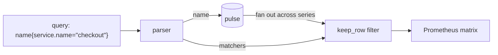

Once telemetry is in the durable stores — whether through the
[gateway](/getting-started/gateway/) or the [CLI](/getting-started/quick-start/)
— you read it back through a small set of HTTP endpoints. The metrics endpoint
speaks the Prometheus query protocol Prism already understands; logs and traces
return plain JSON.

This page is a practical walkthrough. The exact contract, including every error
case, is in the [Query API reference](/reference/query-api/).

## Metrics: Prometheus-shaped range queries



`GET /api/v1/query_range` reads metrics out of the durable Pulse store and
answers in the matrix shape Prometheus clients expect. The query is a metric
name, optionally followed by label matchers:

```
http_requests_total
http_requests_total{service.name="checkout"}
http_requests_total{service.name!="batch"}
http_requests_total{route=~"/api/.*"}
```

Supported matchers are equality (`=`), inequality (`!=`), regex (`=~`) and
negated regex (`!~`). Values are double-quoted; multiple matchers are ANDed.
Label names may contain dots, because labels are OpenTelemetry-shaped.

Two behaviours worth knowing, both chosen so the number on your screen never
lies:

- **Regex is whole-value anchored.** `service.name=~"check"` does *not* match
  `checkout`; every pattern compiles as `^(?:…)$`, exactly like Prometheus. The
  engine is the RE2-derived `regex` crate, so there is no catastrophic
  backtracking to exploit.
- **An absent label is the empty string.** `{env=""}` matches series with no
  `env` label; `{env!=""}` keeps only those that carry one.

Anything the parser does not support — a function, an aggregation, an
unterminated brace — returns a clean `400` that says "not yet", never a
plausible-looking wrong answer. At v0 the `step` parameter is accepted but not
honoured: you get the raw in-window points, not a re-stepped grid.

## Logs: window, severity and body search

`GET /api/v1/logs` returns the records for a tenant inside a time window as a
JSON array, ascending in time:

```sh
curl 'http://localhost:9090/api/v1/logs?start=...&end=...'
```

You can narrow the result before it is capped:

- `min_severity=WARN` — only records at that OTel severity or worse.
- `body_contains=kafka%20timeout` — case-sensitive substring match on the body.
- `body_regex=kafka.*(timeout|timed%20out)` — regex match; use `(?i)` to fold
  case.
- `limit` and `offset` — paginate within the window.

An empty window is a calm `[]` at `200`, not an error — finding nothing is an
ordinary answer. A malformed or back-to-front window is refused with `400`
before the store is even touched.

## Traces: by service-and-window, or by id

`GET /api/v1/traces?service=checkout&start=...&end=...` returns the in-window
spans for a tenant and a service. `service` is required, because Ray's store is
keyed by it; a missing or empty `service` earns a clean `400`.

When you already have the id — from an alert, a log line, or a customer reading
numbers off a screen — look it up directly:

```sh
curl 'http://localhost:9090/api/v1/traces/by_id?trace_id=4bf92f3577b34da6a3ce929d0e0e4736'
```

The id is 32 hex characters, case-insensitive, W3C/OTel shape. An unknown id is
a calm `200 []`, never a `404`.

## Safety caps you will hit on purpose

Every read endpoint enforces two limits, declared as part of the contract: a
maximum window of **24 hours** and a maximum result of **100,000 rows**. Exceed
either and you get a `400` that names which one — not a truncated answer with a
quiet `X-Truncated` header, and not an out-of-memory melt. The reasoning is on
the [Read-side safety caps](/operating/read-caps/) page.
