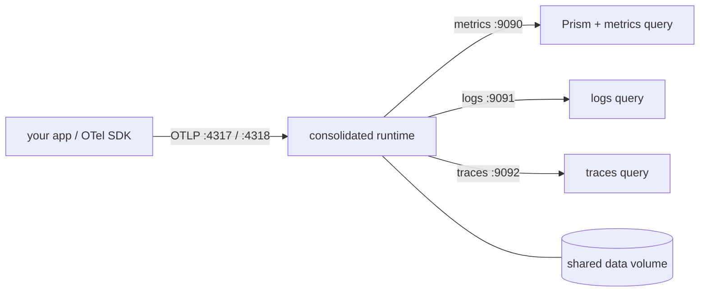

This is the easiest way to try Kaleidoscope end to end on your own machine: one
command brings up a single process that receives telemetry, stores it, answers
queries, and serves the Prism UI — all together, with what you send queryable
straight away.

:::note[Local posture]
This stack is for local experimentation: a single tenant (`acme`), authentication
off, and no TLS. It is not a production deployment. See [Honest
limitations](/operating/limitations/).
:::

## What you need

Docker (with Compose) and a clone of the repository. The `Makefile` is a thin
wrapper over `docker compose`, so you do not need a Rust toolchain.

```sh
git clone https://github.com/andrealaforgia/kaleidoscope.git
cd kaleidoscope
```

## Bring it up

```sh
make up
```

This builds and starts one consolidated runtime container, waits until it is
healthy, and prints the URL. In a single process, sharing one data volume, it
serves:

- OTLP ingest — gRPC on `:4317`, HTTP/protobuf on `:4318`
- Query APIs — metrics on `:9090`, logs on `:9091`, traces on `:9092`
- Prism — served same-origin on `:9090` (no separate web server, no CORS)

Because ingest and query share the same process and the same stores, a metric you
send is immediately queryable — there is no restart step between writing and
reading.



## Send some telemetry

Point any OpenTelemetry SDK, or the OpenTelemetry Collector's OTLP exporter, at
`localhost:4317` (gRPC) or `localhost:4318` (HTTP) and emit as usual. The local
stack runs single-tenant with authentication off, so no bearer token is needed
here.

## See it

Open `http://localhost:9090` for Prism, or query the APIs directly — see [Query
your telemetry](/getting-started/querying/).

## Manage it

```sh
make logs    # follow the runtime logs
make down    # stop the stack, keep your data (the volume is preserved)
make clean   # stop the stack and wipe the data volume (fresh start)
```

## What is not there yet

The `make demo` and `make seed` targets, meant to push sample telemetry for you,
are wired up but depend on a sample-telemetry generator that has not yet landed,
so they fail with a build error until it does. For now, bring your own telemetry
with an SDK or the Collector as above.

And to say it again plainly: this is a local experiment posture — one tenant, no
authentication, no TLS. For the authenticated, multi-signal setup, see [Run the
gateway end to end](/getting-started/gateway/), and for the honest state of
everything, [Is it ready for you?](/start/status/).
