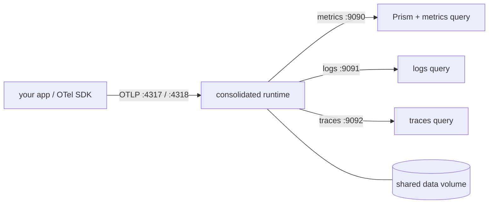

This is the easiest way to try Kaleidoscope end to end on your own machine: one
command brings up a single process that receives telemetry, stores it, answers
queries, and serves the Prism UI — all together, with what you send queryable
straight away.

:::note[Local posture]
This stack is for local experimentation: a single tenant (`acme`), authentication
off, and no TLS. It is not a production deployment. See [Honest
limitations](/operating/limitations/).
:::

## What you need

Docker (with Compose) and a clone of the repository. The `Makefile` is a thin
wrapper over `docker compose`, so you do not need a Rust toolchain.

```sh
git clone https://github.com/andrealaforgia/kaleidoscope.git
cd kaleidoscope
```

## Bring it up

```sh
make up
```

This builds and starts one consolidated runtime container, waits until it is
healthy, and prints the URL. In a single process, sharing one data volume, it
serves:

- OTLP ingest — gRPC on `:4317`, HTTP/protobuf on `:4318`
- Query APIs — metrics on `:9090`, logs on `:9091`, traces on `:9092`
- Prism — served same-origin on `:9090` (no separate web server, no CORS)

The trace query routes (`/api/v1/traces`, `/api/v1/traces/by_id`,
`/api/v1/traces/with_logs`) are also served on the `:9090` origin alongside
metrics and Prism, over the same data and with no CORS, so a same-origin frontend
can read metrics and traces from one place. Logs stay on `:9091`. The standalone
`:9092` traces endpoint is unchanged, so direct API clients can use either.

Because ingest and query share the same process and the same stores, a metric you
send is immediately queryable — there is no restart step between writing and
reading.



## The demo is already there

You do not have to seed anything to see Kaleidoscope working. After `make up`,
the stack already answers with an always-current demo for tenant `acme`, service
`kaleidoscope-demo` — a `request_count` metric, a realistic spread of about a
dozen logs across a handful of customers, and several traces. It is shaped to
tell a small triage story: most of it is healthy noise, with exactly one failed
`POST /api/v1/checkout` trace and its single `checkout failed: card declined`
error log, so searching for the failure is a real search and not a trick. The
failed span is marked with an error status (so a trace-by-id query shows *where*
it failed), and its cause log shows *why*.

This demo is synthesised at read time, not stored: its timestamps are always
relative to now, so the first look is never empty and never stale, and because it
has no write path it never accumulates and never touches your real data. It is
scoped to the demo service only — every other query passes straight through to
the real stores. To turn it off (a staged cutover, or a raw-only instance), set
`KALEIDOSCOPE_DEMO_OVERLAY=0`.

## Send your own telemetry

To exercise the real ingest pipeline, push a genuine OTLP sample — it coexists
with the synthetic demo rather than replacing it:

```sh
make demo    # push a real OTLP sample now (forced)
make seed    # push a real OTLP sample once (marker-gated; no-op if already pushed)
```

The generator runs a reachability check first, so if the stack is not up it names
the unreachable endpoint, exits non-zero, and sends nothing rather than firing
into the void.

To send from your own application instead, point any OpenTelemetry SDK or the
Collector's OTLP exporter at `localhost:4317` (gRPC) or `localhost:4318` (HTTP)
and emit as usual.
The local stack is single-tenant with authentication off, so no bearer token is
needed; just make sure your telemetry uses the same tenant (`acme` by default)
so it is visible. The repository's `examples/otel-external-demo` is a small
Python app that uses only the official OpenTelemetry SDK — no Kaleidoscope
dependency — and is the clearest proof that any standard OTLP source works.

## See it

Open `http://localhost:9090` for Prism and query `request_count` to see the
sample metric plotted. Logs and traces come back as JSON from the query APIs —
see [Query your telemetry](/getting-started/querying/).

## Manage it

```sh
make logs    # follow the runtime logs
make down    # stop the stack, keep your data (the volume is preserved)
make clean   # stop the stack and wipe the data volume (fresh start)
```

The runtime container restarts itself after a crash, an unexpected exit, or a
Docker or host restart, so it stays reachable without you intervening. A
deliberate `make down` is honoured — once you stop it on purpose it stays down
until you bring it back up.

## Keep it honest

To say it plainly: this is a local experiment posture — one tenant, no
authentication, no TLS. It is not a production deployment. For the authenticated,
multi-signal setup, see [Run the gateway end to end](/getting-started/gateway/),
for every setting you can change see the [configuration
reference](/reference/configuration/), and for the honest state of everything,
[Is it ready for you?](/start/status/).
