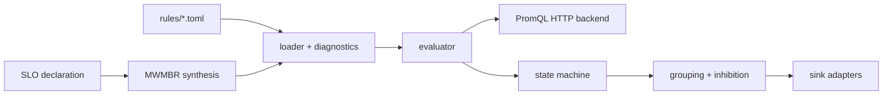
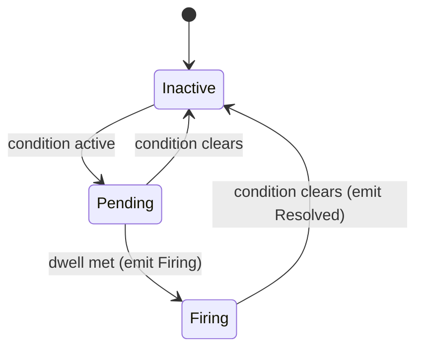

Beacon is the alerting and SLO burn-rate engine. It reads from any
OTel-compatible backend over the Prometheus query protocol, runs a state machine
per rule, and emits incidents to standard sinks. Because it sits in the
integration plane, you can use it today against the backend you already run.

## The pipeline

## Rules as files, with helpful diagnostics

Rules live as files on disk. The schema is semantically CUE-shaped — the same
fields, constraints and enums the architecture intended — but **TOML on the wire**
at v0, because no mature Apache-licensed Rust CUE library exists yet. When Loom's
CUE authority matures, it compiles operator-authored CUE down to the same rule
shape Beacon consumes today.

The loader is defensive. A typo in a field name does not silently disable a rule;
it produces a diagnostic with file, line, and a "did you mean" suggestion
(`nme → name`, `queery → query`) via a Levenshtein match against the blessed
field list.

## A rule's life

The transition function is pure and total on every state-and-outcome pair. The
binary spawns one task per rule, fetches from the backend on each tick, and emits
incidents to the configured sinks.

## Storm collapse

The reason alerting needs grouping and inhibition: with twenty rules and no
inhibition, a single backend outage trips all twenty at once and the pager goes
off twenty times in ninety seconds. Nobody can read that. Beacon's inhibition
resolver collapses a twenty-rule storm to a single notification, then releases
the suppressed alerts correctly when the upstream cause resolves. The behaviour
is deterministic: two replays of the same event sequence produce byte-identical
output.

## SLO burn-rate, by the book

One SLO declaration synthesises four PromQL alert rules, byte-aligned with the
Google SRE workbook's multi-window multi-burn-rate table (1h/5m × 14.4, 6h/30m ×
6, 1d/2h × 3, 3d/6h × 1). You write one SLO; Beacon produces page-level and
ticket-level alerts so the on-call engineer is paged only when the burn rate
truly warrants a response. The workbook table is inlined as constants with the
source URL in a comment, so a reviewer audits it by eye.

## Routing to where your team already is

Beacon ships four HTTP-based sink adapters at v0: a generic webhook, Mattermost,
Zulip, and Grafana OnCall. Each formats the canonical incident for its target
protocol. SMTP is deferred to a later version because TLS, auth and sender config
deserve their own slice.

Header redaction is structural: every adapter builds its outbound payload from
incident fields only, never from headers, and an explicit test asserts that a
configured bearer token never appears in a request body. Secrets are referenced
by environment-variable name in the rule, not embedded.

## Durable across restarts

As covered on the [durability page](/operating/durability/), Beacon's rule state
is durable. Restarting Beacon during an incident does not lose its judgement: a
firing alert stays firing, a pending alert keeps its clock, and the on-call
engineer is not paged again for something already in hand.

## Reload without downtime

Beacon hot-reloads its rule catalogue on `SIGHUP`. A reload is all-or-nothing:
the new catalogue is built and validated completely before anything old is
touched, so a malformed edit leaves the daemon alerting on the previous rules
with a refusal event — never a crash, never a half-applied state. A rule that is
already firing keeps its state across the swap, matched by name, so tuning one
rule does not re-page on-call for an unrelated alert.

To manage those rule files as code, with validation and review gates, see
[Config as code with Loom](/operating/config-as-code/).
