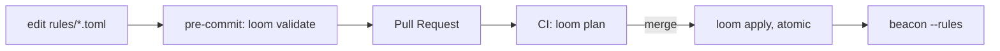

Loom is the change-control surface that puts Kaleidoscope's operational
configuration under version control with a Terraform-style workflow. At v0 it
governs Beacon's rule catalogue; the same pattern transfers to Sieve sampling,
Prism dashboards and Aegis policies in later versions.

## The workflow

Three commands map onto the three moments of a change.

## `loom validate`

Walks a rules directory, parses every file, and maps the result to an exit code:
`0` when every rule loads, `1` when at least one is rejected, `2` when the
directory is unreadable. Diagnostics go to stderr in `file:line: message` form.
An empty directory is exit `0` — a fresh team not yet authoring rules should not
be blocked. This is what you wire into a pre-commit hook so broken rules never
reach the repository.

## `loom plan`

Computes a per-rule diff between your working rules and the deployed ones, in a
pull-request shape: `+ added`, `- removed`, `~ changed`, plus a summary. A
`--diff` flag adds per-field deltas. The output is deterministic: byte-equal
across runs, so two reviewers see the same diff and CI never spuriously reports
drift. This is what you post as a PR comment.

## `loom apply`

Writes the validated rules to the deployment directory with atomic,
crash-safe file operations: each file is written to a sibling `.tmp`, fsynced,
and renamed, so a crash mid-write leaves either the old file or the new one,
never a half-written one. It is idempotent — a second run on the same input
writes zero files — and it preserves files it did not author, so a hand-written
`README.md` alongside the rules is never deleted. A broken source blocks the
apply entirely, leaving pre-existing rules intact.

## CI integration

`loom validate --json` and `loom plan --json` emit a structured payload tagged
with a schema version (`loom.v0`), so a hypothetical `loom.v1` bumps the version
and consumers refuse a mismatch cleanly. The text output remains the default for
pre-commit hooks; the JSON output is for PR-comment posting and bots.

## Why TOML, and where CUE comes in

Loom uses TOML at v0, mirroring Beacon's decision, because the Rust CUE ecosystem
is not yet mature enough for the diagnostic quality the workflow needs. Migrating
to CUE is a parser swap behind the same workflow when that ecosystem matures —
another instance of the [ports and adapters](/concepts/ports-and-adapters/)
discipline.
