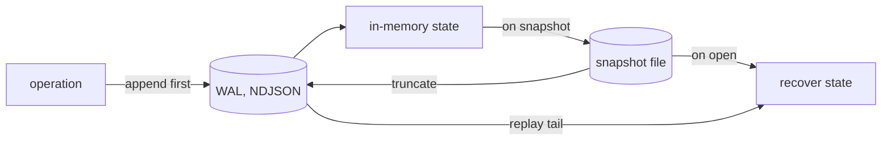
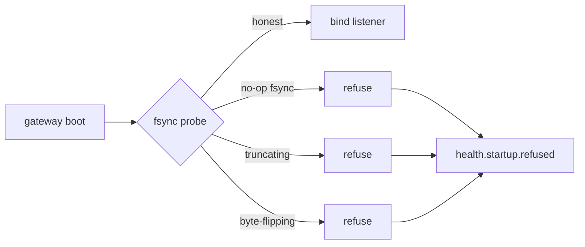

"Durable" is a word vendors throw around cheaply. Kaleidoscope earns it with code
you can point at, and with tests designed to fail if the durability is fake. This
page is for operators deciding whether to trust the storage plane with data.

## WAL plus snapshot, six times over

Every durable v1 store uses the same machinery: a write-ahead log of operations,
plus a snapshot that compacts state and truncates the log, with recovery that
loads the snapshot first and then replays the remaining WAL.

That same pattern now holds across six data shapes of rising weight — tier
metadata, a queue, log records, metric series, trace spans, and pprof profiles
(the heaviest object the platform stores). A single shared `apply` routine serves
both the live path and recovery, so the two cannot drift. A pattern applied six
times across rising complexity without breaking is the platform's spine, not a
guess.

## Write-ahead means write *first*

The point of a write-ahead log is in its name: record the intention before you
change live state, so a crash can never leave you having acted on something you
never recorded. One component (Cinder) was caught doing it backwards — mutating
memory and then writing the log, discarding the log's result. A failing disk
would drop the write while the placement lived on in memory as "durable", then
vanished on restart. The fix reorders the work: append to the log first, touch
memory only on success, and surface an error loudly if the disk refuses.

## Real fsync, proven by a lying disk

A subtler defect: several stores acknowledged a write and then only `flush()`ed
it — into the kernel page cache, not onto the disk. Every restart test reopened
the store in the *same process*, so the page cache survived and the tests passed.
1194 passing tests is not the same sentence as "durable".

The fix added `sync_all` on every WAL append and on the snapshot, and an
`fsync` on the parent directory so the rename itself is durable on POSIX. The
proof had to be split, because the obvious test is a lie:

- **Snapshot atomicity** is proven by a real out-of-process `SIGKILL`
  mid-snapshot. A torn file is a physical artefact, so this catches a
  non-atomic snapshot honestly.
- **The fsync itself** only shows under a substrate that drops unsynced bytes.
  A startup probe writes a sentinel, syncs, drops the handle, reopens, and reads
  it back. If the disk lied about persistence, the round trip catches it and the
  gateway **refuses to bind**.

The honest cost is named: per-record `sync_all` is slower than a buffered flush,
so the affected latency budget was widened and a future batched-fsync
optimisation recorded. Durability first, performance later.

## Torn-tail recovery

After a crash, the last WAL line is often half-written — no trailing newline.
A naive parse-or-die recovery refuses to start at all, which breaks the
survives-a-restart promise. Kaleidoscope drops **only** a final torn line
(detected by the absent newline byte), recovers the intact acked prefix, and
warns. Mid-file corruption and a newline-terminated malformed last line still
fail closed, because those are not crash artefacts. The discriminator is the
missing newline, not a guess at the parser's error.

## Durable alert state

Durability is not only about stored data. Beacon, the alerting engine, used to
re-seed its rule state to "quiet" on every start. A restart during an incident
made the incident worse: a firing alert came back as if nothing was wrong, then
re-crossed its threshold and paged the on-call engineer a second time. Beacon's
rule state is now durable, with a deliberately different contract from the data
stores — keyed latest-wins rather than append-and-sort, because alert state is
the current answer to a question, not a log of events.

## What this adds up to

Seven stores are durable, and the test suite now holds the kill-9 tests the word
"durable" was cashing cheques against. This is the project's "Earned Trust"
principle in code: verify what the substrate actually delivers, refuse honestly
when you cannot keep a promise, make the refusal visible, and never silently
degrade.
