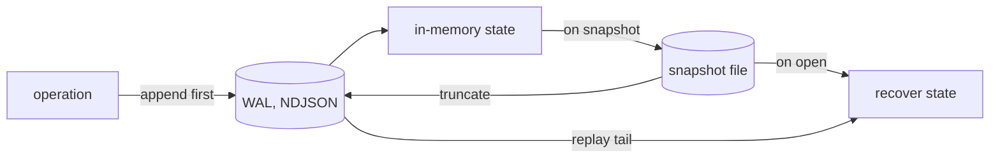
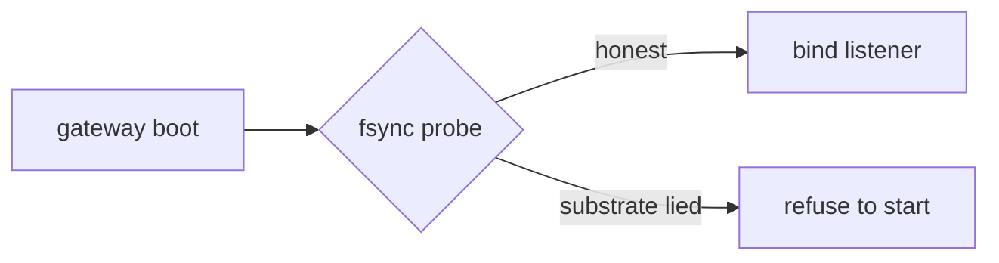

This page is for operators deciding whether to trust the storage plane with data.
It describes how the durable stores persist, recover, and refuse when they cannot
keep their promise.

## WAL plus snapshot

Every durable v1 store uses the same machinery: a write-ahead log of operations,
plus a snapshot that compacts state and truncates the log, with recovery that
loads the snapshot first and then replays the remaining log.

The same pattern is used by all six durable stores — tier metadata, the queue,
logs, metrics, traces and profiles. A single shared routine serves both the live
write path and recovery, so the two cannot drift.

## Write-ahead means write first

The intention is recorded in the log before live state changes, so a crash can
never leave the store having acted on something it never recorded. Writes append
to the log first and touch in-memory state only on success; if the disk refuses a
write, the operation fails loudly rather than acknowledging a change that did not
persist.

## Real fsync, and a startup probe

Acknowledged writes are flushed to disk with `fsync`, not merely handed to the
operating system's page cache: every log append and every snapshot is synced, and
the parent directory is synced too, so a new snapshot's rename is itself durable
on POSIX.

To guard against a substrate that does not honour `fsync` (some virtualised or
network disks quietly drop unsynced bytes), the gateway runs a probe at startup:
it writes a sentinel, syncs, closes and reopens the file, and reads it back. If
the round trip does not return what was written, the gateway **refuses to bind**
rather than serve on storage it cannot trust.

The cost is real: per-record `fsync` is slower than a buffered flush, so the
relevant latency budgets are set accordingly. The platform chooses durability
first.

## Torn-tail recovery

After a crash the last log line is often half-written, with no trailing newline.
Rather than refusing to start, recovery drops only a final torn line, recovers
the intact acknowledged prefix, and warns. Mid-file corruption and a
newline-terminated but malformed last line still fail closed, because those are
not crash artefacts — the discriminator is the missing final newline, not a guess
at the parser's error.

## Durable alert state

Durability is not only about stored telemetry. [Beacon](/components/beacon/), the
alerting engine, persists its rule state, so restarting it during an incident
does not lose its judgement: a firing alert stays firing rather than re-paging
the on-call engineer. Its store uses a deliberately different contract from the
data stores — keyed latest-wins rather than append-and-sort — because alert state
is the current answer to a question, not a log of events.

## The principle

Across all of this the rule is the same: verify what the substrate actually
delivers, refuse honestly when a promise cannot be kept, make the refusal
visible, and never silently degrade.
