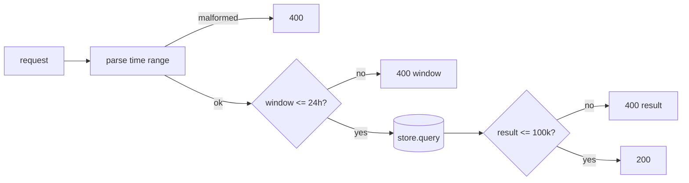
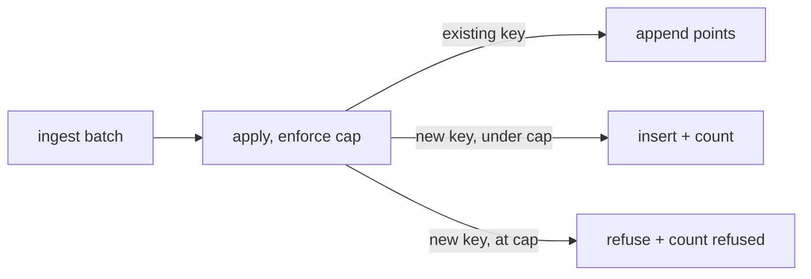

A platform that only writes is half a platform; a platform that reads without
limits is a self-DoS waiting to happen. Kaleidoscope's read APIs and metrics
ingest both carry honest caps. As an operator you will hit them on purpose, so it
is worth knowing why they are shaped the way they are.

## The two read caps

Every read endpoint — metrics, logs, traces — enforces two limits. They are fixed
parts of the read contract, not tucked away in configuration:

- **Maximum window: 24 hours.**
- **Maximum result: 100,000 rows.**

The window check runs after parsing and before the store is touched; the result
check runs after the store and before serialisation.

## Refuse, do not truncate

The decision that deserves naming: a request that exceeds a cap gets a `400` that
names which cap — `window` or `result` — not a truncated answer with a quiet
`X-Truncated: true` header.

Truncating is comfortable but silent. An operator behind that client takes wrong
decisions on data that no longer represents the query they asked. Honest refusal
says out loud that the query was the wrong size and points at the lever to pull
(narrow the window). For a platform whose entire argument is "verify before you
serve", refusal is the only consistent choice. The error body never echoes raw
values or forwarded headers.

## Paginating within the cap

The log endpoint supports `limit` and `offset`. Paging runs *after* the cap
check, in memory, over the materialised window. This means you cannot page beyond
100,000 rows; to go further you narrow the window. That limitation is recorded
honestly rather than smuggled away — in-store pagination that lifts the ceiling
is named future work.

## The write-side cap: cardinality watermark

The read side is not the only DoS surface. Once Pulse learned to tell two
services apart, each distinct label set became a distinct series — which means a
client emitting a growing-cardinality label (a timestamp, a UUID, a request id)
could fill the index until it ran out of memory.

So each tenant gets a soft watermark of **10,000 series**. Above the cap, a new
label set is refused at ingest and counted; existing series keep receiving
points. Because the count is per-tenant, a noisy neighbour cannot starve a quiet
one. The refusal is visible both to the caller (the ingest response reports how
many series were refused) and to the platform (a `pulse.series.refused.count`
metric).

Crucially, the cap is a **forward gate, never a retroactive eviction**. A
snapshot or WAL that already holds 50,000 series rebuilds all of them on
recovery — a process that wrote them to disk is trusted to have meant it. The cap
applies only to new series during live ingest after recovery.

## These caps are tunable in principle

The values are constants in the read contract today, chosen as sane defaults for
an evaluation deployment. They are the kind of thing a production deployment would
expose as configuration. As with everything on this site, the
[limitations](/operating/limitations/) page is honest that configurable caps are
not the same as the current hard-coded ones.
