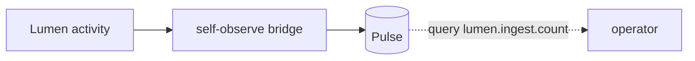

An observability platform that cannot observe itself is not credible.
Kaleidoscope watches its own behaviour using its own metrics engine — no external
infrastructure required — and can export that telemetry to a collector you already
run.

## Observing itself with Pulse

Every component can emit its own operational metrics without depending on any
particular telemetry backend. Those metrics are fed into [Pulse](/components/pulse/),
the platform's own metrics engine, named by convention
(`lumen.ingest.count`, `cinder.migrate.count`, and so on), with the tenant
preserved. An operator then queries them like any other metric.



The same pattern fits every component, so extending it is mechanical.

## Exporting to a collector you already run

For a real deployment you usually want Kaleidoscope's internal telemetry in the
same collector as everything else. The CLI's `--observe-otlp <path>` flag writes
one OTLP-JSON line per operation to a file. You open a second terminal, run
`tail -f` on it, and a small sidecar reads each line and posts it to your
OTLP/HTTP collector.

```mermaid
flowchart LR
    CLI[kaleidoscope-cli --observe-otlp] -->|OTLP-JSON lines| F[/tmp/otlp.log]
    F -.->|tail -f or sidecar| Side[sidecar]
    Side -.->|POST| Coll[(your OTLP collector)]
```

This is a deliberately simple bridge that leaves the network to a sidecar; a
heavier exporter that pushes directly is a later version, for when a real
deployment needs it.

## What is recorded today

Ingest, query and state-changing actions on the CLI are all recordable through the
same collector. An incident-response session — query the window, see the tier
distribution, move items, verify the move — leaves a complete record without any
extra tooling, in the same shape whether you touch one item by hand or run a bulk
policy.
