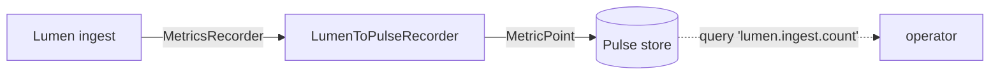

An observability platform that cannot observe itself is not credible.
Kaleidoscope watches its own behaviour using its own primitives — no external
infrastructure required — and can export that telemetry to a collector you
already run.

## The seam every component carries

Every component exposes a `MetricsRecorder` seam, so it can emit its own
operational metrics without depending on a particular telemetry backend. A
`NoopRecorder` makes it free when you do not want it; a `CapturingRecorder` makes
it testable.

## Observing itself with Pulse

The self-observe bridge wires those seams into Pulse, the platform's own metrics
engine. Each component event becomes a metric point in Pulse, named by
convention (`lumen.ingest.count`, `cinder.migrate.count`, and so on), with the
tenant identity passing through unchanged.



The same `XxxToPulseRecorder` pattern fits every component — Cinder, Sluice,
Augur, Ray, Strata. It is demonstrated once and extending it is mechanical.

## Exporting to a collector you already run

For a real deployment you usually want Kaleidoscope's internal telemetry in the
same collector as everything else. The CLI's `--observe-otlp <path>` flag writes
one OTLP-JSON line per operation to a file, in the minimal subset of the OTLP
spec a collector consumes. You open a second terminal, `tail -f` the file, and a
sidecar reads it and POSTs each line to your OTLP/HTTP collector.

```mermaid
flowchart LR
    CLI[kaleidoscope-cli --observe-otlp] -->|NDJSON OTLP-JSON| F[/tmp/otlp.log]
    F -.->|tail -f or sidecar| Side[OTLP/HTTP sidecar]
    Side -.->|POST| Coll[(OTLP collector)]
```

This deliberately avoids pulling in the full `opentelemetry-otlp` stack (Tokio,
Tonic, prost) for what is a leaf-flat, synchronous bridge. A heavier
push-semantics exporter is a later version, added when a real deployment needs
it.

## What is recorded today

Ingest, query and state-mutating actions on the CLI are all recordable through
the same OTLP collector. An incident-response session — query the window, see
the tier distribution, move items, verify the move — leaves a complete forensic
record without any extra tooling. The wire shape is the same whether you touch
one item by hand or run a bulk policy.
