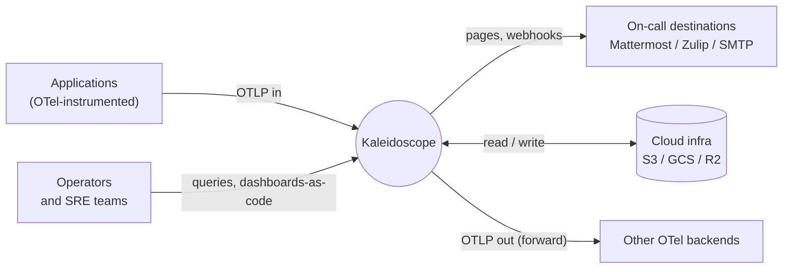

Kaleidoscope is an end-to-end observability platform built around the
**OpenTelemetry** project's wire formats and semantic conventions. Applications
emit telemetry through the OpenTelemetry SDKs; Kaleidoscope receives it as OTLP,
processes it, stores it in its own first-party storage engines, and exposes it
through query, alerting and visualisation services that Kaleidoscope owns from
top to bottom.

It aims to do the work of Datadog, New Relic, Splunk, Dynatrace, BetterStack,
Honeycomb, Grafana Cloud, Chronosphere, and the LGTM and ELK stacks combined —
and to do it without a per-host bill, a per-GB bill, a per-cardinality bill, a
per-seat bill, or a "contact sales" page.

A kaleidoscope refracts grey light into a clean spectrum. Same job here: refract
raw telemetry into the four signals — logs, metrics, traces and profiles — and
present them as one coherent view.

## The boundary is OpenTelemetry

Applications emit OTLP. Operators query and configure. Cloud storage holds the
telemetry data. On-call destinations receive alerts. Kaleidoscope can also
forward OTLP downstream, so it integrates with anything OTel-compatible rather
than locking you in.

## Three commitments that define the project

**Built from scratch, not assembled.** Kaleidoscope's components are first-party
code, not thin wrappers around peer projects. Pulse is not a re-skinned Mimir.
Lumen is not a re-skinned Loki. Ray is not a re-skinned Tempo. Prism is not a
re-skinned Grafana. Each component is a service Kaleidoscope owns, ships, and is
solely responsible for.

**Built on FOSS libraries, not on FOSS platforms.** A library is code
Kaleidoscope embeds; a platform is a service it would have to depend on. Apache
Arrow, Parquet, DataFusion, Iceberg, Tokio, Hyper, Tonic, RocksDB and the like
are libraries Kaleidoscope embeds. ClickHouse, Mimir, Loki, Tempo, Prometheus,
Grafana and Elasticsearch are *peers* it competes with and therefore does not
consume.

**Implements OpenTelemetry standards everywhere.** The wire contract between
every external component and Kaleidoscope, and between its internal components,
is an OpenTelemetry-defined format. Ingest is OTLP. Resource and instrumentation
attributes follow OpenTelemetry Semantic Conventions. Profiles use the pprof
format and the emerging OpenTelemetry Profiles signal.

## What Kaleidoscope is *not*

It is **not a Datadog clone**. It does not aim to copy Datadog's UX pixel for
pixel. It aims to make the *job* Datadog does available without the *bill*.

It is **not a magic bullet**. Self-hosting observability is a real operational
commitment. For many teams the right answer is still a SaaS until the bill
becomes unbearable, then Kaleidoscope.

It is **not a single binary**. It is a platform of cooperating components. Each
can be replaced, ignored, or run standalone — that is the point of putting OTLP
at every seam.

It is **not a wrapper around an existing OSS stack**. It is not Mimir + Loki +
Tempo + Pyroscope + Grafana with a new logo.

## Where to go next

If you are weighing adoption, read [Is it ready for you?](/start/status/) for an
honest account of what runs today. If you want the economic argument, read
[Why it exists](/start/why/). If you just want to try it, jump to the
[quick start](/getting-started/quick-start/).
