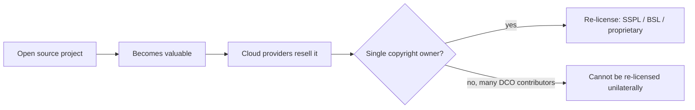

## The cost problem

Modern observability has a cost problem. The tools that watch production are
themselves a recurring six- or seven-figure line item for any non-trivial
business. The pricing models — per-host, per-GB, per-custom-metric,
per-cardinality, per-seat — punish exactly the engineering practices the same
vendors evangelise: rich instrumentation, high-fidelity tracing, long retention,
broad team access.

Open-source alternatives exist and are excellent: the LGTM stack, the ELK stack,
ClickHouse-based projects like SigNoz and Uptrace, and OpenTelemetry itself. But
they are fragmented — many projects, many query languages, many operational
paradigms, many storage engines. Adopting them well is itself a specialist
skill.

Kaleidoscope is the integrated alternative. It owns its components end to end,
depends only on FOSS libraries, exposes OpenTelemetry standards at every external
surface, and is licensed so anyone can use it and nobody can re-license it later.

## How it defeats the cost model

The big vendors charge for things that, in a well-built FOSS platform, are not
expensive. The structural cost of running Kaleidoscope is the cost of the
underlying compute and storage — the same cloud bill the vendors are also
paying, plus their margin. Removing the margin is the entire economic thesis.

| The vendor charges for… | Kaleidoscope's answer |
| --- | --- |
| Per-host agent licences | Spark is an SDK. No per-host fee, ever. |
| Per-GB log ingest, with surge pricing | Lumen is a first-party log engine on Apache Parquet in your object storage. You pay the cloud storage bill. |
| Custom metrics over a low free quota | Pulse has no metric-count surcharge. Your TSDB has whatever cardinality your hardware supports. |
| Per-million-span APM | Ray charges nothing per span; Sieve drops what you don't need. |
| Profile storage as a top-tier add-on | Strata is included as a passive profile store. |
| Long-term retention as a separate "Flex" / "Archive" SKU | Cinder's tiering is built in; cold storage is just S3 / GCS / R2. |
| Per-user dashboard seats | Prism has no seat licensing. |
| SSO, RBAC, audit log as an "Enterprise" tier | Aegis is in the free product. Always. |
| AIops / anomaly detection as an upsell | Augur is included; bring your own model if you want a fancier one. |
| "Contact sales" for compliance reports | The compliance dashboards in Prism are open templates. |

Kaleidoscope itself is free; the cloud underneath is not.

## The rug-pull problem

There is a second, structural problem. Elastic. MongoDB. Redis. HashiCorp. Each
one was open source. Each one re-licensed once it became valuable enough that a
cloud provider could resell it. The pattern is structural, not accidental: when
a single company owns the copyright, the temptation to capture the value it
created is eventually irresistible.

## The Kaleidoscope answer

Kaleidoscope is built from scratch on Apache Foundation substrate, with no
commercial dependencies, and licensed in two classes by component role:
AGPL-3.0-or-later for platform components, Apache-2.0 for SDKs and protocol
libraries. Contributions are accepted under the Developer Certificate of Origin.
There is no Contributor Licence Agreement, and there will be no Contributor
Licence Agreement.

With many contributors and no concentrated copyright assignment, no future
maintainer or entity can unilaterally re-license Kaleidoscope, because nobody
will own enough of the copyright to legally do it. That is the structural
protection. The licence text alone is necessary but not sufficient.

The full rationale, and what it means for you as a user, is on the
[Licensing](/background/licensing/) page.
